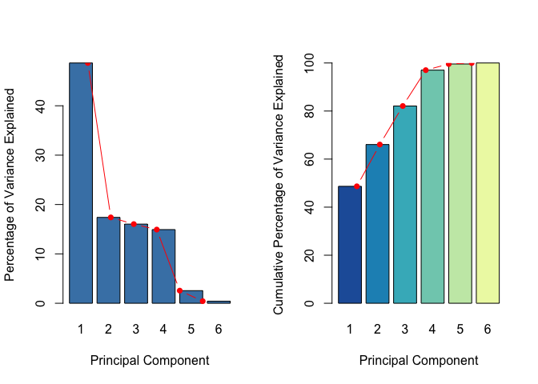
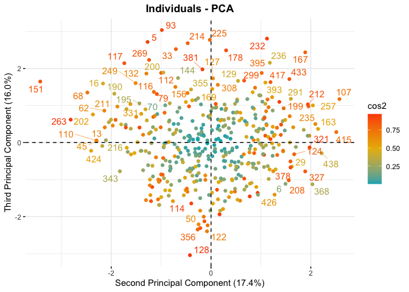
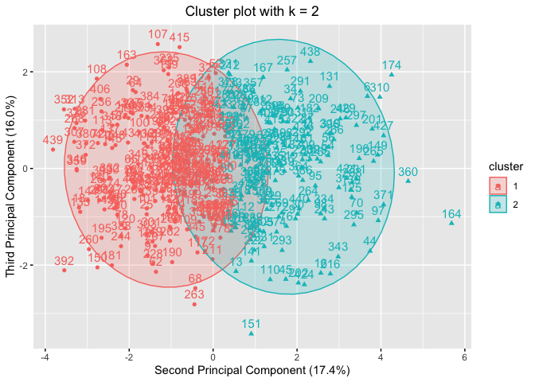
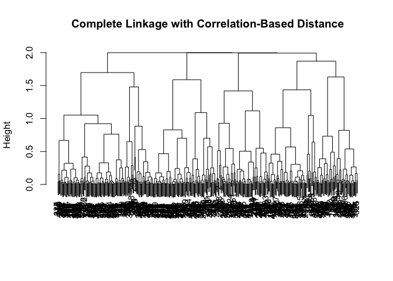

Clustering Wholesale Products
================
Zarina
16/06/2022

# Motivation

-   Unsupervised learning techniques are of growing importance in a
    number of fields because these allow interesting patterns and
    subgroups to be discovered among many observations measured on a set
    of variables.

-   For instance, in business and marketing, wholesalers might be
    interested in finding groups of high yield products that are most
    profitable or have growth potential based on the frequency of
    transactions. They might also be interested in identifying groups of
    products that are most frequently purchased together by customers to
    customise and optimise their sale strategies – e.g., provide a range
    of offers, prices, promotions, products distributions, or some
    combinations of marketing segments to increase the chances of
    products being purchased. Besides that, they might also want to
    identify groups of customers that share similar profiles, such as
    purchasing behaviours and histories, so that they can be
    preferentially shown the products in which they are particularly
    likely to be interested.

-   Therefore, the main goal of unsupervised learning is not to predict
    the response 𝑦 as there is no associated response variable 𝑦 in a
    dataset. Instead, it aims to look for informative patterns and
    interesting subgroups to mediate the downstream analysis and
    applications.

## Aim

This report, subsequently, presents the results of the unsupervised
learning techniques used – namely, the Principal Components Analysis
(PCA) and several clustering algorithms such as K-means/K-medoids,
(agglomerative and divisive) hierarchical, and model- based clusterings
– in a real dataset which comprises 440 observations corresponding to
annual spending in monetary units (m.u) on six product categories
(fresh, milk, grocery, frozen, detergents/paper, and delicatessen
products). Therefore, the main goal is to discover interesting patterns
and homogenous subgroups among these observations to enable the
wholesalers to identify interesting products that might be highly
correlated to each other or tend to be purchased together, which may
further improve the marketing and sale strategies.

# Loading dataset

``` r
#1. Loading dataset ----
dat <- read.csv("Wholesale_customers_miss.csv",
                sep = ",", header = TRUE)


names(dat)
```

    ## [1] "Fresh"            "Milk"             "Grocery"          "Frozen"          
    ## [5] "Detergents_Paper" "Delicatessen"

``` r
head(dat)
```

    ##   Fresh Milk Grocery Frozen Detergents_Paper Delicatessen
    ## 1  5.72   NA    2.72   0.75             0.72           NA
    ## 2  5.59 2.87    3.52   0.67             1.61         4.15
    ## 3  6.91 2.42    6.42   2.57             4.83         4.69
    ## 4  5.93 3.15    3.64   1.82             4.86         9.53
    ## 5  6.07 3.35    3.93   1.38            14.46        11.13
    ## 6  7.03   NA    6.74   2.64             0.13           NA

``` r
str(dat)
```

    ## 'data.frame':    440 obs. of  6 variables:
    ##  $ Fresh           : num  5.72 5.59 6.91 5.93 6.07 7.03 6.27 4.68 6.1 5.89 ...
    ##  $ Milk            : num  NA 2.87 2.42 3.15 3.35 NA 2.59 2.89 3.8 3.87 ...
    ##  $ Grocery         : num  2.72 3.52 6.42 3.64 3.93 6.74 4.49 1.64 2.38 2.97 ...
    ##  $ Frozen          : num  0.75 0.67 2.57 1.82 1.38 2.64 1.54 0.13 0.46 0.67 ...
    ##  $ Detergents_Paper: num  0.72 1.61 4.83 4.86 14.46 ...
    ##  $ Delicatessen    : num  NA 4.15 4.69 9.53 11.13 ...

``` r
# change variable name
#names(dat)[names(dat) == "Detergents_Paper"] <- "Detergents.Paper"
```

# Data explorations

## Box plots of ALL variables & outliers

``` r
# using ggplot
library(ggplot2)
library("reshape2")
data_long <- melt(dat)
```

    ## No id variables; using all as measure variables

``` r
head(data_long)
```

    ##   variable value
    ## 1    Fresh  5.72
    ## 2    Fresh  5.59
    ## 3    Fresh  6.91
    ## 4    Fresh  5.93
    ## 5    Fresh  6.07
    ## 6    Fresh  7.03

``` r
ggplot(data_long,
       aes(x = variable, y = value, fill = variable)) + ggtitle("Boxplots of all variables")+
  geom_boxplot() + theme(legend.position = "bottom",
                         plot.title = element_text(face = "bold", h = 0.5)) + labs(x = "Variable", y = "Value"
                      ) + scale_fill_discrete(name = "Variable")
```

    ## Warning: Removed 222 rows containing non-finite values (stat_boxplot).

<!-- -->
\* The highest annual spending is recorded on delicatessen products
among all products. This is followed by fresh, detergents/paper,
grocery, milk, and frozen products.

-   In terms of the distribution of each variable, the annual spending
    on most of the fresh, milk, and grocery products are normally
    distributed. On the other hand, the annual spending on frozen and
    detergents/paper products is slightly right-skewed, possibly driven
    by extreme outliers. It is also worth noting that two distinct peaks
    are observed around 5 (m.u) and 10 (m.u) for annual spending on
    delicatessen products.

-   In addition, each variable appears to have extreme outliers, with
    most variables having two outliers.

``` r
## Outliers in Fresh
out <- boxplot.stats(dat$Fresh)$out
idx <- which(dat$Fresh %in% c(out))
dat[idx, c("Fresh")]
```

    ##  [1] 8.06 8.03 8.84 8.06 7.90 3.63 3.50 8.32 8.36 3.55

``` r
## Outliers in Milk
out <- boxplot.stats(dat$Milk)$out
idx <- which(dat$Milk %in% c(out))
dat[idx, c("Milk")]
```

    ## [1] 4.27

``` r
## Outliers in Grocery
out <- boxplot.stats(dat$Grocery)$out
idx <- which(dat$Grocery %in% c(out))
dat[idx, c("Grocery")]
```

    ## [1] 9.24 8.26

``` r
## Outliers in Frozen
out <- boxplot.stats(dat$Frozen)$out
idx <- which(dat$Frozen %in% c(out))
dat[idx, c("Frozen")]
```

    ## [1] 3.63 3.43

``` r
## Outliers in Detergents_Paper
out <- boxplot.stats(dat$Detergents_Paper)$out
idx <- which(dat$Detergents_Paper %in% c(out))
dat[idx, c("Detergents_Paper")]
```

    ## [1] 16.26

``` r
## Outliers in Delicatessen
out <- boxplot.stats(dat$Delicatessen)$out
idx <- which(dat$Delicatessen %in% c(out))
dat[idx, c("Delicatessen")]
```

    ## [1] 18.09 16.94

## Histograms

``` r
# using ggplot
ggplot(data_long,
       aes(x = value, fill = variable))+
  geom_histogram(aes(y = ..density..)
                 )+
  geom_density(lwd = 0.5, col = "red", alpha = 0.01)+ 
  facet_wrap(~variable, scales = "free") +
  ggtitle("Density Distributions")+
  theme(legend.position = "bottom", plot.title = element_text(face = "bold", h = 0.5))+
  labs(x = "Value", y = "Density") +
  scale_fill_discrete(name = "Variable")
```

    ## `stat_bin()` using `bins = 30`. Pick better value with `binwidth`.

    ## Warning: Removed 222 rows containing non-finite values (stat_bin).

    ## Warning: Removed 222 rows containing non-finite values (stat_density).

<!-- -->

## Correlation plot

A correlation matrix plot is also obtained to explore the relationship
between the variables in the data set.

``` r
library(corrplot)
```

    ## corrplot 0.92 loaded

``` r
library(RColorBrewer)
library(psych)
```

    ## 
    ## Attaching package: 'psych'

    ## The following objects are masked from 'package:ggplot2':
    ## 
    ##     %+%, alpha

``` r
# remove missing values in order to calculate correlation
data <- na.omit(dat)
round(cor(data), 2)
```

    ##                  Fresh  Milk Grocery Frozen Detergents_Paper Delicatessen
    ## Fresh             1.00 -0.11    0.86   0.79            -0.02         0.01
    ## Milk             -0.11  1.00   -0.43  -0.38             0.07         0.00
    ## Grocery           0.86 -0.43    1.00   0.95            -0.03         0.00
    ## Frozen            0.79 -0.38    0.95   1.00            -0.05         0.00
    ## Detergents_Paper -0.02  0.07   -0.03  -0.05             1.00         0.01
    ## Delicatessen      0.01  0.00    0.00   0.00             0.01         1.00

``` r
corrplot(cor(data), 
         tl.cex = 0.75, 
         method = "circle", 
         type = "upper", order = "hclust", 
         col = brewer.pal(n=8, name="RdYlBu"), 
         tl.col = "red", 
         diag=FALSE )
```

<!-- -->

``` r
pairs.panels(data,
             method = "pearson",
             hist.col = "steelblue",
             density = TRUE,
             ellipses = TRUE)
```

<!-- -->
\* There are three pairs of variables that are highly, positively
correlated with each other:Frozen & Grocery (0.95), Frozen & Fresh
(0.79), and Grocery & Fresh (0.86).

-   In contrast, two pairs of variables have moderate, negative
    correlations. These include Milk & Grocery (-0.43) and Milk & Frozen
    (- 0.38).

-   The rest of the variables are either entirely not correlated with
    each other (such as most of the variables with Delicatessen) or very
    weakly, negatively correlated.

-   Overall, there is evidence that the variables Fresh, Grocery, and
    Frozen share incredibly redundant information, which needs to be
    tackled to reduce the redundancy.

## Parallel Coordinate Plot

``` r
library(GGally)
```

    ## Registered S3 method overwritten by 'GGally':
    ##   method from   
    ##   +.gg   ggplot2

``` r
ggparcoord(dat,
           alphaLines = 0.2,
           splineFactor = TRUE,
           scale = "uniminmax") +
  scale_color_manual("green") +
 labs(x = "Variable", y = "Value") + ggtitle("Parallel Coordinates Plot") + theme(plot.title = element_text(h = 0.5, face = "bold"))
```

<!-- -->

# Missing values analysis

The distribution of missing data can also be visualized via a matrix
plot.

-   Indeed, a more significant portion of missing data (red) occurs in
    the variable Milk than in Delicatessen. In particular, the missing
    data pattern displays quite apparent independence where the missing
    data in Delicatessen appear to be random across all observations in
    the data set.

-   In addition, the upper block of the matrix where high missing data
    are observed in Delicatessen seems to occur at higher levels of
    Milk, which is consistent with the results obtained from the margin
    plot previously (horizontal red boxplots).

``` r
library(mice)
```

    ## 
    ## Attaching package: 'mice'

    ## The following object is masked from 'package:stats':
    ## 
    ##     filter

    ## The following objects are masked from 'package:base':
    ## 
    ##     cbind, rbind

``` r
library(VIM)
```

    ## Loading required package: colorspace

    ## Loading required package: grid

    ## VIM is ready to use.

    ## Suggestions and bug-reports can be submitted at: https://github.com/statistikat/VIM/issues

    ## 
    ## Attaching package: 'VIM'

    ## The following object is masked from 'package:datasets':
    ## 
    ##     sleep

``` r
sum(is.na(dat))
```

    ## [1] 222

``` r
md.pattern(dat,  plot = TRUE)
```

<!-- -->

    ##     Fresh Grocery Frozen Detergents_Paper Delicatessen Milk    
    ## 270     1       1      1                1            1    1   0
    ## 78      1       1      1                1            1    0   1
    ## 40      1       1      1                1            0    1   1
    ## 52      1       1      1                1            0    0   2
    ##         0       0      0                0           92  130 222

``` r
md.pairs(dat)
```

    ## $rr
    ##                  Fresh Milk Grocery Frozen Detergents_Paper Delicatessen
    ## Fresh              440  310     440    440              440          348
    ## Milk               310  310     310    310              310          270
    ## Grocery            440  310     440    440              440          348
    ## Frozen             440  310     440    440              440          348
    ## Detergents_Paper   440  310     440    440              440          348
    ## Delicatessen       348  270     348    348              348          348
    ## 
    ## $rm
    ##                  Fresh Milk Grocery Frozen Detergents_Paper Delicatessen
    ## Fresh                0  130       0      0                0           92
    ## Milk                 0    0       0      0                0           40
    ## Grocery              0  130       0      0                0           92
    ## Frozen               0  130       0      0                0           92
    ## Detergents_Paper     0  130       0      0                0           92
    ## Delicatessen         0   78       0      0                0            0
    ## 
    ## $mr
    ##                  Fresh Milk Grocery Frozen Detergents_Paper Delicatessen
    ## Fresh                0    0       0      0                0            0
    ## Milk               130    0     130    130              130           78
    ## Grocery              0    0       0      0                0            0
    ## Frozen               0    0       0      0                0            0
    ## Detergents_Paper     0    0       0      0                0            0
    ## Delicatessen        92   40      92     92               92            0
    ## 
    ## $mm
    ##                  Fresh Milk Grocery Frozen Detergents_Paper Delicatessen
    ## Fresh                0    0       0      0                0            0
    ## Milk                 0  130       0      0                0           52
    ## Grocery              0    0       0      0                0            0
    ## Frozen               0    0       0      0                0            0
    ## Detergents_Paper     0    0       0      0                0            0
    ## Delicatessen         0   52       0      0                0           92

``` r
scattmatrixMiss(dat)
```

<!-- -->

    ## 
    ## Click in a diagonal panel to add to or remove from the highlight selection.
    ## To regain use of the VIM GUI and the R console, click anywhere else in the graphics window.
    ## 
    ## Highlighted missings in any of the variables 'Fresh', 'Milk', 'Grocery', 'Frozen', 'Detergents_Paper', 'Delicatessen'.

``` r
# cor matrix
shadow <- as.data.frame(abs(is.na(dat)))
miss.shadow <- shadow[, which(unlist(lapply(shadow, sum))!=0)]
round(cor(miss.shadow), 3)
```

    ##               Milk Delicatessen
    ## Milk         1.000        0.304
    ## Delicatessen 0.304        1.000

``` r
round(cor(dat[!names(dat)%in%c("Milk")],
          miss.shadow, use = "pairwise.complete.obs"), 3)
```

    ## Warning in cor(dat[!names(dat) %in% c("Milk")], miss.shadow, use =
    ## "pairwise.complete.obs"): the standard deviation is zero

    ##                    Milk Delicatessen
    ## Fresh            -0.046        0.048
    ## Grocery          -0.028        0.056
    ## Frozen           -0.002        0.076
    ## Detergents_Paper -0.121       -0.498
    ## Delicatessen     -0.029           NA

``` r
aggr(dat,
     col = mdc(1:2),
     numbers = TRUE,
     sortVars = TRUE,
     labels = names(dat),
     cex.axis = .7,
     gap = 3,
     ylab = c("Proportion of Missingness", "Missingness Pattern"))
```

<!-- -->

    ## 
    ##  Variables sorted by number of missings: 
    ##          Variable     Count
    ##              Milk 0.2954545
    ##      Delicatessen 0.2090909
    ##             Fresh 0.0000000
    ##           Grocery 0.0000000
    ##            Frozen 0.0000000
    ##  Detergents_Paper 0.0000000

``` r
marginplot(dat[, c("Milk", "Delicatessen")],
           col = mdc(1:2),
           cex.numbers = 1.2,
           pch = 19)
```

<!-- -->

``` r
names(dat)[names(dat) == "Dtrgnt_Ppr"] <- "Dtrgnt_Pr"
names(dat)[names(dat) == "Delicatessen"] <- "Delicatessn"

par(mfrow = c(1, 1))
matrixplot(dat, labels = TRUE, interactive = F, main = "Matrix Plot", sortby = 5)
```

<!-- -->

``` r
which(is.na(dat$Milk))
```

    ##   [1]   1   6  15  17  18  29  30  35  38  40  41  45  46  47  49  51  54  56
    ##  [19]  57  62  64  74  76  80  81  85  90  91  96  98 110 113 116 124 127 128
    ##  [37] 129 143 144 146 147 148 149 154 155 158 160 168 170 172 184 187 191 199
    ##  [55] 201 208 209 210 212 213 215 221 225 234 235 237 239 243 251 252 254 257
    ##  [73] 269 272 273 274 279 282 284 285 287 288 289 291 292 293 298 299 302 307
    ##  [91] 308 314 318 322 323 325 326 328 332 342 344 349 351 354 361 362 367 368
    ## [109] 378 387 388 389 390 392 395 396 397 398 399 402 408 413 415 416 420 429
    ## [127] 435 437 439 440

# 3.1 Multiple imputation

For this data set, the imputation analysis involves using all variables
as predictors to impute the missing values in the variables Milk and
Delicatessen using three methods:

-   Predictive mean matching (PMM), which is based on selecting a data
    point from the original, non- missing data that has a predicted
    value close to the predicted value of the missing sample

-   Bayesian linear regression (NORM)

-   Linear regression ignoring model error (NORM.NOB).

The imputation is repeated ten times, producing ten complete/imputed
data sets (m = 10). The quality of the imputation is compared between
different methods used. Only one of the completed data sets that matches
the observed data well is used for the subsequent analysis.

``` r
# with PMM
mice_dat <- mice(dat, m = 10, seed = 123)
```

    ## 
    ##  iter imp variable
    ##   1   1  Milk  Delicatessn
    ##   1   2  Milk  Delicatessn
    ##   1   3  Milk  Delicatessn
    ##   1   4  Milk  Delicatessn
    ##   1   5  Milk  Delicatessn
    ##   1   6  Milk  Delicatessn
    ##   1   7  Milk  Delicatessn
    ##   1   8  Milk  Delicatessn
    ##   1   9  Milk  Delicatessn
    ##   1   10  Milk  Delicatessn
    ##   2   1  Milk  Delicatessn
    ##   2   2  Milk  Delicatessn
    ##   2   3  Milk  Delicatessn
    ##   2   4  Milk  Delicatessn
    ##   2   5  Milk  Delicatessn
    ##   2   6  Milk  Delicatessn
    ##   2   7  Milk  Delicatessn
    ##   2   8  Milk  Delicatessn
    ##   2   9  Milk  Delicatessn
    ##   2   10  Milk  Delicatessn
    ##   3   1  Milk  Delicatessn
    ##   3   2  Milk  Delicatessn
    ##   3   3  Milk  Delicatessn
    ##   3   4  Milk  Delicatessn
    ##   3   5  Milk  Delicatessn
    ##   3   6  Milk  Delicatessn
    ##   3   7  Milk  Delicatessn
    ##   3   8  Milk  Delicatessn
    ##   3   9  Milk  Delicatessn
    ##   3   10  Milk  Delicatessn
    ##   4   1  Milk  Delicatessn
    ##   4   2  Milk  Delicatessn
    ##   4   3  Milk  Delicatessn
    ##   4   4  Milk  Delicatessn
    ##   4   5  Milk  Delicatessn
    ##   4   6  Milk  Delicatessn
    ##   4   7  Milk  Delicatessn
    ##   4   8  Milk  Delicatessn
    ##   4   9  Milk  Delicatessn
    ##   4   10  Milk  Delicatessn
    ##   5   1  Milk  Delicatessn
    ##   5   2  Milk  Delicatessn
    ##   5   3  Milk  Delicatessn
    ##   5   4  Milk  Delicatessn
    ##   5   5  Milk  Delicatessn
    ##   5   6  Milk  Delicatessn
    ##   5   7  Milk  Delicatessn
    ##   5   8  Milk  Delicatessn
    ##   5   9  Milk  Delicatessn
    ##   5   10  Milk  Delicatessn

``` r
summary(mice_dat)
```

    ## Class: mids
    ## Number of multiple imputations:  10 
    ## Imputation methods:
    ##            Fresh             Milk          Grocery           Frozen 
    ##               ""            "pmm"               ""               "" 
    ## Detergents_Paper      Delicatessn 
    ##               ""            "pmm" 
    ## PredictorMatrix:
    ##                  Fresh Milk Grocery Frozen Detergents_Paper Delicatessn
    ## Fresh                0    1       1      1                1           1
    ## Milk                 1    0       1      1                1           1
    ## Grocery              1    1       0      1                1           1
    ## Frozen               1    1       1      0                1           1
    ## Detergents_Paper     1    1       1      1                0           1
    ## Delicatessn          1    1       1      1                1           0

``` r
# with (Bayesian) linear regression
mice_dat2 <- mice(dat, m = 10, seed = 123,
                  method = c("","norm.nob","", "", "","norm"))
```

    ## 
    ##  iter imp variable
    ##   1   1  Milk  Delicatessn
    ##   1   2  Milk  Delicatessn
    ##   1   3  Milk  Delicatessn
    ##   1   4  Milk  Delicatessn
    ##   1   5  Milk  Delicatessn
    ##   1   6  Milk  Delicatessn
    ##   1   7  Milk  Delicatessn
    ##   1   8  Milk  Delicatessn
    ##   1   9  Milk  Delicatessn
    ##   1   10  Milk  Delicatessn
    ##   2   1  Milk  Delicatessn
    ##   2   2  Milk  Delicatessn
    ##   2   3  Milk  Delicatessn
    ##   2   4  Milk  Delicatessn
    ##   2   5  Milk  Delicatessn
    ##   2   6  Milk  Delicatessn
    ##   2   7  Milk  Delicatessn
    ##   2   8  Milk  Delicatessn
    ##   2   9  Milk  Delicatessn
    ##   2   10  Milk  Delicatessn
    ##   3   1  Milk  Delicatessn
    ##   3   2  Milk  Delicatessn
    ##   3   3  Milk  Delicatessn
    ##   3   4  Milk  Delicatessn
    ##   3   5  Milk  Delicatessn
    ##   3   6  Milk  Delicatessn
    ##   3   7  Milk  Delicatessn
    ##   3   8  Milk  Delicatessn
    ##   3   9  Milk  Delicatessn
    ##   3   10  Milk  Delicatessn
    ##   4   1  Milk  Delicatessn
    ##   4   2  Milk  Delicatessn
    ##   4   3  Milk  Delicatessn
    ##   4   4  Milk  Delicatessn
    ##   4   5  Milk  Delicatessn
    ##   4   6  Milk  Delicatessn
    ##   4   7  Milk  Delicatessn
    ##   4   8  Milk  Delicatessn
    ##   4   9  Milk  Delicatessn
    ##   4   10  Milk  Delicatessn
    ##   5   1  Milk  Delicatessn
    ##   5   2  Milk  Delicatessn
    ##   5   3  Milk  Delicatessn
    ##   5   4  Milk  Delicatessn
    ##   5   5  Milk  Delicatessn
    ##   5   6  Milk  Delicatessn
    ##   5   7  Milk  Delicatessn
    ##   5   8  Milk  Delicatessn
    ##   5   9  Milk  Delicatessn
    ##   5   10  Milk  Delicatessn

``` r
summary(mice_dat2)
```

    ## Class: mids
    ## Number of multiple imputations:  10 
    ## Imputation methods:
    ##            Fresh             Milk          Grocery           Frozen 
    ##               ""       "norm.nob"               ""               "" 
    ## Detergents_Paper      Delicatessn 
    ##               ""           "norm" 
    ## PredictorMatrix:
    ##                  Fresh Milk Grocery Frozen Detergents_Paper Delicatessn
    ## Fresh                0    1       1      1                1           1
    ## Milk                 1    0       1      1                1           1
    ## Grocery              1    1       0      1                1           1
    ## Frozen               1    1       1      0                1           1
    ## Detergents_Paper     1    1       1      1                0           1
    ## Delicatessn          1    1       1      1                1           0

``` r
summary(mice_dat2$imp)
```

    ##                  Length Class      Mode
    ## Fresh            10     data.frame list
    ## Milk             10     data.frame list
    ## Grocery          10     data.frame list
    ## Frozen           10     data.frame list
    ## Detergents_Paper 10     data.frame list
    ## Delicatessn      10     data.frame list

``` r
## extract the 2nd imputed data set
completed_dat <- complete(mice_dat, 2)
head(completed_dat)
```

    ##   Fresh Milk Grocery Frozen Detergents_Paper Delicatessn
    ## 1  5.72 3.11    2.72   0.75             0.72        7.27
    ## 2  5.59 2.87    3.52   0.67             1.61        4.15
    ## 3  6.91 2.42    6.42   2.57             4.83        4.69
    ## 4  5.93 3.15    3.64   1.82             4.86        9.53
    ## 5  6.07 3.35    3.93   1.38            14.46       11.13
    ## 6  7.03 2.59    6.74   2.64             0.13       12.57

``` r
completed_dat2 <- complete(mice_dat2, 2)
head(completed_dat2)
```

    ##   Fresh     Milk Grocery Frozen Detergents_Paper Delicatessn
    ## 1  5.72 3.455008    2.72   0.75             0.72    8.669572
    ## 2  5.59 2.870000    3.52   0.67             1.61    4.150000
    ## 3  6.91 2.420000    6.42   2.57             4.83    4.690000
    ## 4  5.93 3.150000    3.64   1.82             4.86    9.530000
    ## 5  6.07 3.350000    3.93   1.38            14.46   11.130000
    ## 6  7.03 1.938211    6.74   2.64             0.13    8.868171

``` r
require(lattice)
```

    ## Loading required package: lattice

``` r
#xyplots 
library(gridExtra)

xyplot(mice_dat, Milk ~ Delicatessn|as.factor(.imp), pch = 18, cex = 1, main = "PMM")
```

<!-- -->

``` r
xyplot(mice_dat2, Milk ~ Delicatessn|as.factor(.imp), pch = 20,
               cex = 1.4, main = "(Bayesian) Linear Regression")
```

<!-- -->

``` r
# density plots

densityplot(mice_dat, main = "PMM")
```

<!-- -->

``` r
densityplot(mice_dat2, main = "(Bayesian) Linear Regression")
```

<!-- -->
\# PCA

The data set has also presented evidence for multicollinearity between
variables. Thus, there is an undesirably high chance of information
redundancy. Therefore, PCA is used to reduce the dimensionality of the
data set by keeping only a small number of dimensions or principal
components that still explains most of the variability in the data.

PCA then allows better visualisation of data using fewer representative
variables that still retain as much of the information as possible, thus
minimising the effects of multicollinearity and information redundancy
for downstream analysis. Otherwise, 15 scatterplots will be needed to
visualise 440 observations, which will certainly not be possible to look
at all of them; moreover, most likely none of them will be informative
since they each contain only a small fraction of the total information
present in the data set. Therefore, PCA is performed on this data set as
part of an exploratory data analysis, and the results of PCA are then
subsequently used in clustering.

## Using Scaled data

To perform PCA, all variables in the imputed data set are first scaled
to have mean zero and standard deviation one. This step is considered
necessary because performing PCA on unscaled data would cause a greater
weightage or importance to be placed onto variables with higher
variances than other variables.

In addition, even though the variables are measured in the same unit
(m.u), some products may be purchased more frequently than others. For
instance, this data set highlights higher annual spending on
delicatessen products than frozen products. If these are not scaled,
high-yield purchases like delicatessen products will have a larger
effect on inter-products dissimilarities, hence, on the clusters
ultimately obtained, than low purchases like frozen products.

In contrast, if scaling is first performed on the variables, then each
variable will, in effect, be given equal importance in the subsequent
clustering performed.

``` r
library(factoextra)
```

    ## Welcome! Want to learn more? See two factoextra-related books at https://goo.gl/ve3WBa

``` r
pr.out2 <- prcomp(completed_dat2,
                 scale = TRUE)
# scree plot
fviz_screeplot(pr.out2, addlabels = TRUE, barfill = c("#225ea8", "#1d91c0","#41b6c4",
                                                     "#7fcdbb", "#c7e9b4", "#edf8b1"), 
               barcolor = c("#0c2c84", "#1d91c0","#41b6c4",
                            "#7fcdbb", "#c7e9b4", "#edf8b1")) + theme(plot.title = element_text(face = "bold", h = 0.5)) + labs(x = "Principal Component", y = "Percentage of Variance Explained") + ggtitle("PCA on Scaled Data")
```

<!-- -->

``` r
fviz_pca_var(pr.out2,
                   col.var = "contrib", # Color by contributions to the PC
                   gradient.cols = c("#00AFBB", "#E7B800", "#FC4E07"),
                   repel = TRUE     # Avoid text overlapping
) + theme(plot.title = element_text(face = "bold", h = 0.5)) + labs(x = "First Principal Component (48.7%)", y = "Second Principal Component (17.4%)") + ggtitle("Variables - PCA - Scaled Data")
```

<!-- -->

``` r
# contribution of variables on scaled data to compare
```

## using unscaled data to compare

``` r
pr.out <- prcomp(completed_dat2,
                 scale = FALSE)
pr.out
```

    ## Standard deviations (1, .., p=6):
    ## [1] 3.6554472 3.2835636 1.9602044 0.5140628 0.2775069 0.1632337
    ## 
    ## Rotation (n x k) = (6 x 6):
    ##                          PC1          PC2         PC3           PC4
    ## Fresh             0.02018122 -0.011236207  0.38428129 -0.6322585672
    ## Milk             -0.00604909  0.008862579 -0.09410769 -0.7512807292
    ## Grocery           0.04787817 -0.032614231  0.85393151  0.1665779987
    ## Frozen            0.01737518 -0.019068103  0.33118658  0.0896183826
    ## Detergents_Paper -0.26041682  0.964031191  0.05246045  0.0068162061
    ## Delicatessn       0.96392167  0.262700942 -0.04284793  0.0004747871
    ##                           PC5          PC6
    ## Fresh             0.575644445 -0.347385851
    ## Milk             -0.575003027  0.309802180
    ## Grocery          -0.100213221  0.479222331
    ## Frozen           -0.572673806 -0.744085489
    ## Detergents_Paper -0.002443962 -0.004733846
    ## Delicatessn      -0.001020382 -0.002452221

``` r
# scree plot
library(factoextra)
fviz_screeplot(pr.out, addlabels = TRUE, barfill = c("#225ea8", "#1d91c0","#41b6c4",
                                                     "#7fcdbb", "#c7e9b4", "#edf8b1"), 
               barcolor = c("#0c2c84", "#1d91c0","#41b6c4",
                            "#7fcdbb", "#c7e9b4", "#edf8b1")) + theme(plot.title = element_text(face = "bold", h = 0.5)) + labs(x = "Principal Component", y = "Percentage of Variance Explained") + ggtitle("PCA on Unscaled Data")
```

<!-- -->

``` r
# cumulative var plot
fviz_eig(pr.out)
```

<!-- -->

``` r
# contribution of variables on unscaled data
fviz_pca_var(pr.out,
             col.var = "contrib", # Color by contributions to the PC
             gradient.cols = c("#00AFBB", "#E7B800", "#FC4E07"),
             repel = TRUE     # Avoid text overlapping
) + theme(plot.title = element_text(face = "bold", h = 0.5)) + labs(x = "First Principal Component (47.1%)", y = "Second Principal Component (38.0%)") + ggtitle("Variables - PCA - Unscaled Data")
```

<!-- -->
Indeed, the principal loadings are different when the variables are not
scaled to have mean zero and standard deviation one, as shown above.
Observe that the first principal component places the largest weight on
the variable Delicatessen, whereas the second principal component places
most of its weight on the variable Detergents/Paper.

By far, these two variables have the largest variances among all
variables (13.17 and 10.94, respectively). Their variances are about ten
times higher than the variances of other variables. For example, the
variance for the other four variables is comparably very small: Fresh
(0.71), Milk (0.21), Grocery (2.86), Frozen (0.47). Therefore, when
unscaled, the loading vector places much less weight on these variables.
As predicted, the contributions of Delicatessen and Detergents/Paper
variables are incredibly high. When comparing this result with the
previous one, it can be seen that scaling does indeed have a substantial
effect on the results obtained.

## PCA on imputed data 1

``` r
## 5.1 Using manual ----
## check to use covariance matrix or correlation matrix (scale the data)

sd <- apply(completed_dat2, 2, sd)
sd
```

    ##            Fresh             Milk          Grocery           Frozen 
    ##        0.8417787        0.4610194        1.6906211        0.6866855 
    ## Detergents_Paper      Delicatessn 
    ##        3.3070984        3.6285857

``` r
var.means <- apply(completed_dat2, 2, mean)
var.means
```

    ##            Fresh             Milk          Grocery           Frozen 
    ##         5.846136         3.049161         3.792614         1.242955 
    ## Detergents_Paper      Delicatessn 
    ##         5.330727         6.619815

``` r
## There are on average as twice as many Delicatessen as Grocery, and more than 6 times as many Delicatessen as Frozen

var.variance <-apply(completed_dat2, 2, var)
var.variance
```

    ##            Fresh             Milk          Grocery           Frozen 
    ##        0.7085914        0.2125389        2.8581998        0.4715370 
    ## Detergents_Paper      Delicatessn 
    ##       10.9369002       13.1666343

``` r
## Not suprisingly, the variablese also have vastly different variances: the Delicatessen by far has the largest mean and variance. If we failed to scale the variables before performing PCA, then most of the principal components observed would be driven by the Delicatessen varuable. Thus, it is important to standardize the variables to have mean zero and standard deviation one before performing PCA.

## the variables should be scaled/correlation matrix used

S <- cor(completed_dat2)
eigdec <- eigen(S)
eigdec
```

    ## eigen() decomposition
    ## $values
    ## [1] 2.92009818 1.04341592 0.96205901 0.89544467 0.15349146 0.02549077
    ## 
    ## $vectors
    ##             [,1]        [,2]        [,3]        [,4]         [,5]         [,6]
    ## [1,]  0.51610050 -0.11049346 0.187842001 -0.33511527  0.686534441 -0.320179739
    ## [2,] -0.27734560 -0.11965702 0.412800702 -0.80906529 -0.253480078  0.139708257
    ## [3,]  0.57889984 -0.05394567 0.023419125 -0.01383370 -0.079618128  0.809250250
    ## [4,]  0.56113155 -0.04538065 0.005091103 -0.05264913 -0.676363533 -0.472023840
    ## [5,] -0.06353569 -0.71947245 0.552613804  0.41499735 -0.023038716 -0.013675251
    ## [6,]  0.05185815  0.67146351 0.698823706  0.24067614 -0.008991844 -0.009330167

``` r
# eigenvalues/ variances
eig <- eigdec$values
eig
```

    ## [1] 2.92009818 1.04341592 0.96205901 0.89544467 0.15349146 0.02549077

``` r
# eigenvectors/ PC loadings
pc_loading <- eigdec$vectors
rownames(pc_loading) <- colnames(completed_dat2)
pc_loading
```

    ##                         [,1]        [,2]        [,3]        [,4]         [,5]
    ## Fresh             0.51610050 -0.11049346 0.187842001 -0.33511527  0.686534441
    ## Milk             -0.27734560 -0.11965702 0.412800702 -0.80906529 -0.253480078
    ## Grocery           0.57889984 -0.05394567 0.023419125 -0.01383370 -0.079618128
    ## Frozen            0.56113155 -0.04538065 0.005091103 -0.05264913 -0.676363533
    ## Detergents_Paper -0.06353569 -0.71947245 0.552613804  0.41499735 -0.023038716
    ## Delicatessn       0.05185815  0.67146351 0.698823706  0.24067614 -0.008991844
    ##                          [,6]
    ## Fresh            -0.320179739
    ## Milk              0.139708257
    ## Grocery           0.809250250
    ## Frozen           -0.472023840
    ## Detergents_Paper -0.013675251
    ## Delicatessn      -0.009330167

``` r
# the proportion of variance explained
eig <- eigdec$values
variance <- eig*100/sum(eig)

# cumulative variances
cumvar <- cumsum(variance)
eig2 <- data.frame(eig = eig,
                   variance = variance,
                   cumvariance = cumvar)
eig2
```

    ##          eig   variance cumvariance
    ## 1 2.92009818 48.6683029    48.66830
    ## 2 1.04341592 17.3902654    66.05857
    ## 3 0.96205901 16.0343168    82.09289
    ## 4 0.89544467 14.9240778    97.01696
    ## 5 0.15349146  2.5581909    99.57515
    ## 6 0.02549077  0.4248462   100.00000

``` r
# scree plot
par(mfrow = c(1, 2))
barplot(eig2[, 2],
        names.arg = 1:nrow(eig2),
        xlab = "Principal Component",
        ylab = "Percentage of Variance Explained",
        col = "steelblue")
lines(x = 1:nrow(eig2),
      eig2[, 2],
      type = "b", 
      col = "red",
      pch = 16)

# cumvar scree plot
barplot(eig2[, 3],
        names.arg = 1:nrow(eig2),
        xlab = "Principal Component",
        ylab = "Cumulative Percentage of Variance Explained",
        col = c("#225ea8", "#1d91c0","#41b6c4",
                "#7fcdbb", "#c7e9b4", "#edf8b1"))

lines(x = 1:nrow(eig2),
      eig2[, 3],
      type = "b", 
      col = "red",
      pch = 16)
```

<!-- -->

``` r
pc_score = as.matrix(scale(completed_dat))%*% pc_loading
colnames(pc_score) <- paste0("PC", 1:6)
pc_score[1:4,]
```

    ##             PC1        PC2        PC3        PC4        PC5         PC6
    ## [1,] -0.8064834  1.2234124 -0.5579092 -0.5990315  0.4080951 -0.07946595
    ## [2,] -0.5944185  0.4883196 -1.2722915 -0.2234963  0.4791884  0.33865569
    ## [3,]  2.9818705 -0.3807162 -0.6866434  0.3257743 -0.2245784 -0.23471146
    ## [4,]  0.4413121  0.6203371  0.6913712 -0.1678418 -0.5749101 -0.46532975

``` r
pairs.panels(pc_score,
             method = "pearson", # correlation method
             hist.col = "#00AFBB",
             density = TRUE,  # show density plots
             ellipses = TRUE # show correlation ellipses
)
```

<!-- -->

``` r
# Using Factoextra library 


pr.out <- prcomp(completed_dat2,
                 scale = TRUE)
names(pr.out)
```

    ## [1] "sdev"     "rotation" "center"   "scale"    "x"

``` r
summary(pr.out)
```

    ## Importance of components:
    ##                           PC1    PC2    PC3    PC4     PC5     PC6
    ## Standard deviation     1.7088 1.0215 0.9808 0.9463 0.39178 0.15966
    ## Proportion of Variance 0.4867 0.1739 0.1603 0.1492 0.02558 0.00425
    ## Cumulative Proportion  0.4867 0.6606 0.8209 0.9702 0.99575 1.00000

``` r
#PC loadings
pr.out$rotation
```

    ##                          PC1         PC2         PC3         PC4          PC5
    ## Fresh             0.51610050 -0.11049346 0.187842001 -0.33511527  0.686534441
    ## Milk             -0.27734560 -0.11965702 0.412800702 -0.80906529 -0.253480078
    ## Grocery           0.57889984 -0.05394567 0.023419125 -0.01383370 -0.079618128
    ## Frozen            0.56113155 -0.04538065 0.005091103 -0.05264913 -0.676363533
    ## Detergents_Paper -0.06353569 -0.71947245 0.552613804  0.41499735 -0.023038716
    ## Delicatessn       0.05185815  0.67146351 0.698823706  0.24067614 -0.008991844
    ##                           PC6
    ## Fresh            -0.320179739
    ## Milk              0.139708257
    ## Grocery           0.809250250
    ## Frozen           -0.472023840
    ## Detergents_Paper -0.013675251
    ## Delicatessn      -0.009330167

``` r
#PC score
pr.out$x
```

    ##                 PC1           PC2          PC3          PC4           PC5
    ##   [1,] -0.973719989  1.3604090238 -0.058950311 -1.058084313  0.2370800704
    ##   [2,] -0.574615771  0.4791092650 -1.322991428 -0.168173371  0.4988295092
    ##   [3,]  2.996873417 -0.3960570800 -0.735052705  0.366535975 -0.2089715650
    ##   [4,]  0.460668245  0.5704872684  0.592980579 -0.119392392 -0.5521635303
    ##   [5,]  0.004368146 -1.2724156626  2.716352872  0.816044032 -0.1990618864
    ##   [6,]  3.677070378  1.4940694436 -1.115420325  0.843633857  0.0921679839
    ##   [7,]  1.040079827  0.3232010434  0.146590469  0.787730314  0.2652390544
    ##   [8,] -2.362438099 -0.8248597962 -0.512629763  1.018061577  0.3210463952
    ##   [9,] -1.557773821 -1.8002917866  0.489302538 -1.158089742  0.6160471023
    ##  [10,] -1.182940399  0.2720353827  1.027359512 -1.329808997  0.1854864142
    ##  [11,]  2.256461811  0.7106214373 -1.183827109  0.764443036  0.1842643497
    ##  [12,]  0.729297445  0.3676419266 -0.266371191  0.652931558 -0.3480058425
    ##  [13,]  0.544942873 -2.1287829819  0.409359960  1.280381256  0.3342837844
    ##  [14,]  0.106844029  0.8828972838  1.480582000  0.701601374 -0.7527073573
    ##  [15,] -0.964081241  1.2246400119 -0.020084623  0.427220691 -0.1985523950
    ##  [16,]  2.566525846 -2.1644690716  1.594098546 -1.546075024  0.4506975103
    ##  [17,]  0.763407203 -0.0328397019  0.668785211  0.476146750 -0.4900940319
    ##  [18,] -3.197021630 -0.8085919789 -0.695619338 -1.347392120 -0.6340769366
    ##  [19,]  1.147537329 -0.2188152911 -0.303365654 -0.099893068 -0.1863974084
    ##  [20,] -0.890946107  1.1542012484  0.953668146 -0.079072263  0.0397687613
    ##  [21,] -1.867209479 -0.0896841283 -0.638329761  0.945282137  0.4516580338
    ##  [22,] -0.143333180  1.0886762729  0.185625946 -0.082814275  0.3395783836
    ##  [23,] -1.958319696 -0.2288487002 -0.342921905  0.332228002  0.0067069509
    ##  [24,] -1.557781778  0.2596093798 -0.992781380 -1.441348433 -0.3943815540
    ##  [25,] -1.582374773 -0.9487616212 -0.129587025 -1.371384339 -0.1193511168
    ##  [26,] -2.764770743 -0.4213151597  0.157423296  1.617362323 -0.0418700482
    ##  [27,]  1.315848557  0.5236296662  1.163930985  0.789144311 -0.4055267642
    ##  [28,]  0.295330974 -1.1742893229 -0.626855791  1.602041878 -0.1812719047
    ##  [29,] -1.912537789  1.6209456350 -0.648045690 -0.020753240  0.2508636313
    ##  [30,]  2.013418816 -0.9437382472 -0.962035688 -0.150904968 -0.4945973273
    ##  [31,]  0.542662445 -1.2235858160 -0.999711782  0.790886572 -1.1843723575
    ##  [32,] -0.664964237  0.3603994893 -1.472295452 -0.824606226  0.6561221133
    ##  [33,]  1.267608378 -0.7047691854  2.522720021 -0.063040575  0.0306780389
    ##  [34,]  1.847194431  1.4451755075 -0.239919035 -0.119852286  0.6245297624
    ##  [35,]  1.591796945  0.1310281384  0.373462889  0.197341591 -0.1849244161
    ##  [36,]  1.406495876  0.5286630832  0.822233406  0.200649731 -0.5591471640
    ##  [37,]  0.920754752 -0.3737966212 -0.894950266  0.762909883 -0.7396121225
    ##  [38,] -0.479556941  0.6130123083  0.648113773 -0.681348184  0.6158956430
    ##  [39,] -0.716344531 -0.1932522687  0.205102435  0.352008535 -0.0987928075
    ##  [40,] -0.684134388  0.1403820102 -1.532382959 -1.086371075 -0.3826654848
    ##  [41,] -1.112132151  0.2409926468 -1.794851737 -1.130001027  0.1010299140
    ##  [42,] -0.353648151  0.1204653385 -1.274247722 -0.290393625  0.1303080763
    ##  [43,] -2.027940306  0.5363376164 -0.662543347  1.089265940 -0.0039870638
    ##  [44,]  3.741195818 -1.7097849679  0.478056900  0.369817017 -0.4127615211
    ##  [45,]  1.732074971 -2.2923154434  0.048087104  0.597224557 -0.4153476581
    ##  [46,] -2.308207280 -0.8162765668 -0.645996894 -0.240890259 -0.5361043695
    ##  [47,] -0.590317711  0.1012529810  0.078692826  0.844424341 -0.1012338300
    ##  [48,] -0.818075804 -0.0537165634 -0.362707984 -0.684497701  0.0459527673
    ##  [49,]  1.688498042  0.4746793364 -0.535799124  1.639042281 -0.8864132732
    ##  [50,] -0.197190453 -0.2161061065 -1.838820629 -1.392359587 -0.0513566311
    ##  [51,]  0.445142793 -1.1785976315 -1.200386018  0.238151353  0.1984681373
    ##  [52,]  0.062892751  1.9721902898  0.182964002  1.417646617  0.4543407018
    ##  [53,]  0.032672303 -1.2023935074 -1.581258844  0.749077401 -0.1472424720
    ##  [54,]  2.738941456  0.2711768431 -0.668012777  0.568569016  0.7075330181
    ##  [55,] -0.551417556  1.0350884881  0.358865950 -0.923371953  0.2087630292
    ##  [56,]  2.748060662  0.4426073600  0.810554507 -0.764380864  0.2534330118
    ##  [57,] -2.284014808  0.9054504975 -0.704559619  0.860577229  0.3701772062
    ##  [58,]  0.864641861 -1.2409975088  0.243729590  0.622190631  0.2287011736
    ##  [59,] -0.036728740 -1.0293370503 -1.024563764 -0.040636415  0.1262240625
    ##  [60,]  0.337454149 -0.1877656825  0.293014081  0.320872235 -0.6001507516
    ##  [61,]  0.645884217  0.8446018378 -0.664932705 -1.424810361 -0.3154278721
    ##  [62,] -1.362705830 -2.1381194460  0.862314112 -0.936630335  0.0441225967
    ##  [63,] -0.444551817 -0.5108002786 -1.285718608  1.014699543  0.5831546972
    ##  [64,] -1.846882622  1.5803672951  0.002174570 -0.276751691  0.1068911397
    ##  [65,] -1.952120881  0.0004094544  0.852648377 -0.750978550  0.4450674080
    ##  [66,]  0.182086422 -0.4411393801  0.976954205  0.268379284  0.0382764992
    ##  [67,]  0.801952991  1.0443072413 -0.323766989 -1.112322593  0.3717822148
    ##  [68,] -0.423982809 -2.4783734027  1.351045247 -1.507430788 -0.5401984228
    ##  [69,]  1.643053153 -0.9184516862 -1.288976132 -0.326090986  0.0118792453
    ##  [70,]  3.421571957 -0.9178255539  1.005552881  0.638773562  0.3023714841
    ##  [71,] -1.004643659 -0.1666351967 -0.236508765 -0.144177976  0.1841350584
    ##  [72,] -2.746129196  0.5246232479 -0.656833350  0.085005085 -0.8413146923
    ##  [73,]  2.022189869  1.2554387277 -0.141091023  0.476988013 -0.2589693711
    ##  [74,] -1.069385440  1.2464337993 -0.773926721 -0.426235080 -0.0495059118
    ##  [75,] -1.171745618  0.8607434429  0.914186370 -0.273654810 -0.0040700133
    ##  [76,]  1.746423293 -1.1943300668 -0.016203992  0.436345422  0.8194621811
    ##  [77,] -0.459694742  0.7708879984 -0.266084962 -0.421719865 -0.0032751941
    ##  [78,] -2.177194315 -1.1641364012  0.415754902  0.852753312 -0.0616889996
    ##  [79,]  0.220158828 -1.0865095084  1.310039718  0.276078778  0.6129659893
    ##  [80,] -0.367785006 -0.1454519062 -2.002975093 -1.215999145 -0.1336665991
    ##  [81,] -0.216893753 -1.0012175030 -0.860578760  0.504624694 -0.2769975037
    ##  [82,]  0.433570545  0.4968798438 -0.728710884 -1.389894955 -0.7893810224
    ##  [83,] -0.696103390 -0.3065415383 -0.355293709 -0.769529729  0.0701031528
    ##  [84,]  0.899282211 -1.3612556773  0.210276568 -0.038777276 -0.0165559477
    ##  [85,] -0.424271508 -0.3000827754  0.384254311  1.181674482 -0.1737066172
    ##  [86,]  0.855334031  1.4451267235 -0.218916895  0.197228105 -0.1295098408
    ##  [87,]  2.250113174  0.8566121860 -0.574834600  1.248510516  0.4690011473
    ##  [88,]  1.119581551  1.1741605766 -0.726006018  0.116324601  0.5719722234
    ##  [89,] -0.809412732  0.2461039364  0.431892044  0.493592243  0.1261611669
    ##  [90,]  1.772910596  0.9644448564  0.372367412 -1.527773256 -0.0132719731
    ##  [91,]  1.963543601 -1.0398494292 -1.687653817  0.886535657  0.1255016057
    ##  [92,]  0.981631560 -1.3982993049  0.775158446  0.775084016  0.7683187547
    ##  [93,]  0.129666291 -0.9862569944  3.037584794  0.688775389  0.7056230327
    ##  [94,] -0.970224263  0.1520543987 -1.069211669 -0.004834622  0.4832162333
    ##  [95,]  2.437023381 -0.3587146852  0.080486330  1.579212026 -0.7204636864
    ##  [96,] -1.147691880  0.2148186654 -0.220435666  0.242957808  0.2257649595
    ##  [97,]  3.936189014 -1.0772182424  0.769151030  1.762255691 -0.0818799400
    ##  [98,]  2.565866747 -0.9371365352 -0.023174540  0.165034618 -0.2267941705
    ##  [99,] -0.433622533 -0.7271632742 -0.368996012 -0.479188643  0.2107190091
    ## [100,] -1.756362941  0.7541683941 -0.549040734 -0.507585199  0.1087968317
    ## [101,] -1.581282540 -0.8278358332  1.061155422 -0.215978706 -0.7452184971
    ## [102,]  0.639125546  0.7095266946  0.155512613 -0.121045709  0.4458796688
    ## [103,] -0.299916529  0.9349931309 -1.359426121 -0.046661778  0.1318540374
    ## [104,] -0.601459361  0.3565415107  0.389412518 -0.807308856  0.3709567567
    ## [105,] -1.884934755 -0.2893970577 -1.039051979 -0.040157628 -0.4767601019
    ## [106,]  0.165116554  0.0278288084  0.936937753  1.674247151  0.1340751549
    ## [107,] -1.317990627  2.5742435142  1.174280246 -0.930272442  0.2987889317
    ## [108,] -2.772316392  1.8587242806  0.343465101  0.462265528 -0.1795906879
    ## [109,] -0.620151515 -1.2605063325 -0.610990149  2.639970091  0.1817841045
    ## [110,]  1.359160514 -2.2986173350  0.055713051 -0.163773506 -0.4992319881
    ## [111,] -1.041558479 -0.8321685605  0.348889389  1.060591868 -0.3091183127
    ## [112,]  0.751858198 -1.0004534948  1.881240108  0.512650756  0.4830481545
    ## [113,] -2.643169777  0.7967749177 -0.086402813  1.445984724  0.0091081247
    ## [114,] -0.091179054 -0.3953656134 -1.644362047 -0.442336979  0.1180647916
    ## [115,]  0.511703132 -1.2263176203 -1.155680429  0.872527276 -0.1985780981
    ## [116,]  0.230751265 -1.1453375364  1.368294310 -0.930241994  0.0448941170
    ## [117,] -0.372427688 -1.7375212443  2.142372258  0.859229285 -0.3445599613
    ## [118,] -0.957445462  1.1475516115  0.150220607 -0.125218368  0.6497561109
    ## [119,] -1.569471744  0.4522301860  0.641223116  0.265078905  0.3593575559
    ## [120,] -2.091749779 -1.2387986289 -0.279852491 -0.405203533  0.3367713507
    ## [121,]  0.078730992 -1.0582225574 -0.999603823 -0.864751693  0.5081978602
    ## [122,] -1.452113672 -0.0797032561 -2.397059476 -0.136141718  0.4595051534
    ## [123,] -1.116403636 -0.3769763755  1.140860161 -0.406255928  0.2191289533
    ## [124,] -0.282715224  1.6670391710 -0.315480938  0.745768235 -0.1395701149
    ## [125,]  3.304230485 -0.5929874737  0.662443212 -0.127159510  0.9022309998
    ## [126,] -1.558168157 -1.5352592689 -0.282303887 -0.127085359 -0.2504406868
    ## [127,]  0.184779989  0.0392417609  1.732118422  1.297630510 -0.0784260360
    ## [128,]  0.248156957 -0.4222278325 -3.041691780  0.356770745 -0.2779279899
    ## [129,] -1.466281764  0.5411895192  1.665707009  1.406981268  0.0897272526
    ## [130,] -0.057689383  1.0627100257 -0.331034972 -0.161063351  0.2261547618
    ## [131,]  2.774575353  1.7011559675 -0.118613227 -0.314694997 -1.3281004772
    ## [132,]  0.429971398 -1.2953858733  1.863142978 -1.126652163 -0.9833900662
    ## [133,]  0.051582904 -1.1560941752  0.693062609  0.207100458  0.5140346521
    ## [134,] -0.678449229 -0.4845900313 -1.243692578 -0.250154231 -0.1735951147
    ## [135,] -3.167021812 -0.8977832375 -0.002496012 -0.104710755 -0.4324276284
    ## [136,]  2.166110141  0.6687822075 -1.271187027  0.420454377 -0.2861385021
    ## [137,] -2.457513343  0.6112158828 -0.380124091  0.509228628  0.0136804334
    ## [138,]  1.522186144 -0.0465989717 -0.449264261  0.254251382  0.3760990031
    ## [139,]  3.283154502 -0.4343732460  0.185039784 -1.565250530 -0.1325973677
    ## [140,] -2.716093620 -0.3712623831  0.581687421  0.038440916 -0.5005075913
    ## [141,]  0.912166167 -1.9131383062  0.612688232  0.254453019  0.0624844713
    ## [142,] -0.432095854 -0.1129435555 -1.006551974 -0.484212847  0.1264245431
    ## [143,] -2.589587409 -0.8480078790 -1.433355157 -0.291226155  0.2078518129
    ## [144,] -2.981331544 -0.6614031638  1.743058357  0.582071208 -0.4756739463
    ## [145,] -2.406100814  0.4239748253 -0.211162817 -0.540444449  0.5018929368
    ## [146,] -1.001157960 -0.1156836496 -0.166782756 -0.060503135  0.1046796736
    ## [147,] -2.394799748 -0.6310388691 -1.031267231  1.163133155 -0.0877470312
    ## [148,]  1.418644132  1.1002660468 -0.072708502 -0.628013518 -0.2858993254
    ## [149,]  3.920720523  0.2798999975 -1.580962324  0.029470551 -0.2053196714
    ## [150,] -2.756995504 -2.0482687976  0.550137542 -0.802050072  0.0455468476
    ## [151,]  0.908860073 -3.4233023406  1.647294037 -1.062643818  0.6602331452
    ## [152,]  1.201215830  0.4063011309 -1.341467834 -0.595380256 -0.1152488646
    ## [153,]  0.466325285 -0.7584740318  0.226900808  1.236190765  0.2854630393
    ## [154,] -1.666478108 -0.5459381209 -1.423427440  0.205778620  0.5852773054
    ## [155,] -0.244329173  0.8496375298  0.445952951  1.018235355 -0.0743950490
    ## [156,] -0.842731049 -0.7143607890  1.502732252 -0.003905903  0.6524840589
    ## [157,]  1.073445111  0.2106310926  0.614877508  0.074379461 -0.1739171286
    ## [158,] -0.503435150  0.6174104296 -0.568495568 -0.949172545  0.5481447397
    ## [159,]  1.612442684  1.0460586194 -0.133578278  0.631349499 -0.1243759304
    ## [160,] -0.520136003 -0.3584158309 -0.692214466  1.942970231 -0.5890550639
    ## [161,]  2.159948589  0.4131756835 -0.509914063  1.006780031  0.1455624589
    ## [162,] -1.908401693 -0.2595200768  1.197999686  0.602623198 -0.1317667356
    ## [163,] -2.057606169  2.1459498840  0.368135108 -0.034251058  0.1996695986
    ## [164,]  5.683723247 -1.1360416450  0.111015961 -1.434516877 -0.0976930470
    ## [165,] -0.909830765 -0.4726439109 -1.327789663  0.013823136 -0.1237865177
    ## [166,]  0.523702641 -1.1295848825  0.720081196  0.703782638  0.3456654998
    ## [167,]  1.191543520  1.8886329429  2.436078553  0.555498939  0.5213490016
    ## [168,] -1.191476238 -0.6135776695  0.308301938 -1.582366889  0.2663172689
    ## [169,]  1.010053165  0.0240037053  1.446578957  0.009399123 -0.7636154325
    ## [170,]  0.733542429  1.2379751815  0.425828127 -0.964857224  0.0107658584
    ## [171,] -0.401661321 -0.2543027939 -0.501826010 -0.649117794 -0.0440176773
    ## [172,] -0.194114360 -1.7082202280  0.407267379 -0.319930739  0.3591867618
    ## [173,] -0.177935787 -0.5799071271 -0.460925894  1.319105909 -0.2921573015
    ## [174,]  4.254385465  1.9375911690  0.183291920 -0.050754822  0.0911831009
    ## [175,] -1.539657142 -0.1536748129  0.209937448  0.820355060 -0.4029411125
    ## [176,] -2.088687057  1.1104287493  0.494713037 -2.555066785  0.2369481325
    ## [177,]  0.265012092  1.4046716533  0.484235428 -0.136458747  0.3551202671
    ## [178,]  0.586673589  0.3020739430  2.490031849  0.574611974 -0.0447301285
    ## [179,]  0.772628602  0.4992422636  0.807254116 -1.076891314 -0.1927303000
    ## [180,] -0.827221219 -0.2143097033 -2.308569578  0.226751417 -0.2493199880
    ## [181,] -2.412507563 -2.0053187236  0.617925746 -1.122802390 -0.2368644023
    ## [182,]  2.295708413  1.0442358486 -0.311081959 -0.030516380  0.1295569356
    ## [183,] -0.905444195 -1.1047940039  0.350877501  0.841266557 -0.4259743614
    ## [184,] -1.706910246  1.0879791205  1.046660842 -0.525344816 -0.5238119688
    ## [185,] -0.446320483 -0.8473377413  0.014656021 -0.548778396  0.1620073795
    ## [186,] -0.028740492 -0.2650494494  0.112252136  1.514956608  0.2051451670
    ## [187,]  1.885548175  0.2850693005 -0.500344741 -0.676681429  0.1335249950
    ## [188,] -0.139535085 -0.3209428851 -0.269498834 -1.342820730  0.0266277007
    ## [189,]  1.326065778 -0.0743441519 -0.020882281 -1.348229007  0.1032944192
    ## [190,] -0.976050088 -1.9383749706  1.319669927  2.642364096 -0.9261242916
    ## [191,]  0.654697801  0.0701940059 -0.233970111  0.667223280  0.2967682991
    ## [192,] -1.031997692 -1.2075765603  0.279764390 -1.454834184  0.4807474401
    ## [193,]  0.389771997  0.8844430424 -0.181540223  0.618072565  0.3337770366
    ## [194,] -1.380542288  0.7751418382 -0.171305580  0.423398526  0.2795908239
    ## [195,] -2.657610370 -1.4355999894  1.057713632 -0.512909911  0.1809000198
    ## [196,]  3.482756548  0.2084932112  0.908535817 -1.540692373  0.1880119092
    ## [197,]  0.958677525  0.2847330510  0.465959020 -0.171332447 -0.1921730489
    ## [198,] -2.017508080  1.0441621114  0.627846493  1.528602668  0.1185725360
    ## [199,] -1.068510171  1.9531780265  0.975684122  0.423480797 -0.0308266561
    ## [200,] -2.284144500 -0.9555926196  1.890409247  0.972192686  0.4380531833
    ## [201,]  3.792063653  0.8172386645  0.133418610 -1.589381214 -0.7684664940
    ## [202,]  2.032104537 -2.3672179827  0.758075920  0.807884434 -0.2886151054
    ## [203,] -0.605861385 -0.1136500839 -0.886976494 -0.372551838  0.0080481637
    ## [204,]  0.898660376 -1.4752676428  0.011684505  1.310462371  0.5274031487
    ## [205,] -0.765194532  1.1141574921  0.468170971 -0.512863110 -0.1113842944
    ## [206,] -0.788741875 -0.4566727289  0.176479746  1.413299383  0.3442286790
    ## [207,] -1.383541983 -1.6044456319 -0.318976934 -0.234288425  0.4710390690
    ## [208,] -0.832535022  1.5591669949 -1.020283723  0.124423181  0.2693450525
    ## [209,]  2.518538564  1.2365331966  0.865616066 -1.118862155 -0.5157674226
    ## [210,] -0.281310094 -0.0730436927  0.056187058  0.090840778  0.2045808178
    ## [211,] -0.013931931 -1.8773001812  0.971714625 -1.493159163 -0.5283483588
    ## [212,]  0.398418369  1.9406668689  1.030895977 -0.384500643  0.5451084720
    ## [213,]  2.110826272  0.0263581281 -0.366788684 -0.059421288 -0.3999187947
    ## [214,] -1.227215549 -0.4672479219  2.681832670 -0.236246800 -0.1675461251
    ## [215,] -1.913285059  1.1374432714 -0.636268049 -0.994002581  0.0355645586
    ## [216,]  2.793340981 -2.1795547704 -0.091831728 -0.728474049 -0.2804405132
    ## [217,] -0.902149027 -1.0443127776 -1.060265691  0.526746258 -0.1770758618
    ## [218,] -1.275827269  0.9079710996 -1.198667766 -0.501582397 -0.3025031193
    ## [219,] -2.112343981  1.0623104502 -0.659674739  0.206139436 -0.0884923714
    ## [220,] -2.288129860 -0.7306856967 -0.044987532  0.490908562  0.2080335285
    ## [221,] -0.905780034 -1.0617431948 -1.534128002  0.530769866 -0.2766218350
    ## [222,]  0.979118492 -1.6888550449 -0.139473262  1.291809511 -0.5154789404
    ## [223,]  2.128576888  0.1831849595 -1.839722321  1.104258126  0.0909258158
    ## [224,]  1.515390594  0.4259409858 -1.019753032 -0.181852535  0.4532472199
    ## [225,] -0.927092120 -0.0247171243  2.773822764 -1.060770158  0.1385072851
    ## [226,]  0.352964096  0.8639403673 -0.285366943 -0.082750558  0.0754557612
    ## [227,] -1.227387588  0.0834992288 -0.252704663  0.428457671  0.4662149196
    ## [228,] -1.429533824 -1.9687695022  0.458471768  0.528311854  0.0380421428
    ## [229,]  1.391871924 -0.7632620050 -1.582150813  0.062030998  0.4768160768
    ## [230,] -1.876861784 -0.6322703377  0.938561936  1.641044251 -0.0610164583
    ## [231,]  3.415667206 -0.2167066233 -1.501748756 -1.282493510  0.1636489607
    ## [232,] -0.318405834  1.1213831840  2.807272579  0.598841793 -0.2977220470
    ## [233,]  0.041521624 -0.2490316084  0.230482123 -0.294093247 -0.8930498152
    ## [234,] -1.567625023  1.0711536816  0.685355420 -1.679453270  0.0738226622
    ## [235,] -1.047995717  2.0916411032  0.500703879 -1.026085297 -0.5208450816
    ## [236,] -2.659875796  1.1797376353  2.154519942 -1.234498314  0.1205837769
    ## [237,] -0.407898211  0.1075452087  0.950679934 -0.633448299  0.1581974713
    ## [238,]  0.431406496 -0.6920952565  0.345814354 -1.002437174  0.3503057505
    ## [239,]  0.950330924 -1.2155578408 -1.418828717  1.263546656  0.3342273382
    ## [240,] -1.310108992 -0.3090402275 -1.283221474 -0.559279271  0.9576319420
    ## [241,] -1.473669720  0.0205169431 -1.352642268 -0.097662825  0.3816903628
    ## [242,] -0.593483197  0.9090649269  0.318869179  1.533108632  0.4678163957
    ## [243,]  2.655228758 -1.0392151609 -1.682321890 -0.995848772 -0.2857321005
    ## [244,] -2.194703622 -1.6091484043  0.374156630 -0.296743430  0.2878386583
    ## [245,] -0.449640498  0.3023669427  0.917534426 -0.474825399  0.3804891327
    ## [246,]  3.029335835  1.0291036928  1.104765879 -1.318958836 -1.2628993606
    ## [247,] -0.033725541  1.1922119494  0.094135211 -0.322819401  0.0717108047
    ## [248,] -2.327686308  0.4817551252 -1.247714002  0.044082903  0.3114592053
    ## [249,] -1.443136863 -1.5119255397  1.604923860  0.739051779 -0.0217877055
    ## [250,]  0.806117349  0.1471563853  0.103317627 -1.589084692  0.8188029011
    ## [251,] -0.672239718  1.0062389576 -0.050087568 -0.985254024 -0.2958197644
    ## [252,] -1.163468433  0.8357904642  1.359171124  1.120820954 -0.1445100628
    ## [253,] -0.738517812 -0.2751864185 -0.325491003  0.886659905 -0.1964789065
    ## [254,] -0.094209747 -1.0085538946  0.410139199 -0.328512784  0.4607216576
    ## [255,]  2.562346893  0.1389865829  0.623745195 -1.213313557  0.4932054709
    ## [256,]  0.051784281 -0.6961651668 -0.533913044  2.539437897 -0.0174041203
    ## [257,]  1.763603812  2.0418117381  1.002582218 -1.182529955 -0.0746132641
    ## [258,]  0.973402400 -0.3173832796 -0.170051341 -0.589218425 -0.5085135520
    ## [259,] -0.220892012  1.3986451943  0.207056260 -0.210405235 -0.5786750182
    ## [260,] -2.958407055 -1.6702573402 -0.251221534 -1.257374727  0.3180142866
    ## [261,] -1.122476008 -0.1448017621  0.180820504 -0.503233249  0.3408615380
    ## [262,] -1.026378897 -1.4997644534  0.695400942 -0.677218319  0.3163997627
    ## [263,] -0.445407173 -2.8130901355  0.618825041 -0.001401230  0.1036645959
    ## [264,]  2.270335138 -0.6592475830 -0.393135765 -0.115178587 -0.1639205682
    ## [265,]  3.823599370  0.1509024341  0.450216554 -1.555886357 -0.1249508361
    ## [266,]  2.877603033  0.6010760028 -0.909293129  0.060985749  0.1039446796
    ## [267,] -0.241686939  0.8550605679  0.067020500  0.374531135  0.3712896110
    ## [268,] -3.302755995  0.8345383859  0.944997983 -0.766727886 -0.1225817157
    ## [269,] -1.006707952 -1.2417372091  2.230918706  0.271256575 -0.2736156799
    ## [270,]  0.296553133  0.7766434359 -1.452755212 -0.217923789 -0.1602465228
    ## [271,]  1.243434888 -0.0677391291 -2.235633087 -0.362046833 -0.0037536220
    ## [272,]  1.566221681 -0.9982460119 -1.473225196 -0.941703758  0.2607055292
    ## [273,]  1.331655553  0.2894801543  0.876275360  1.007395000 -0.0145153036
    ## [274,] -2.448387921 -0.5095690339 -0.140130022  1.102837710  0.4483275544
    ## [275,]  1.482784434 -0.2491161139 -2.207935850 -0.186879450 -0.7007777204
    ## [276,] -0.727478627  0.4278287494 -0.158964087  0.968164609 -0.0956213353
    ## [277,]  0.312382598  0.2973043410 -0.325543919  0.638568443  0.0696676303
    ## [278,]  0.172596964 -1.4333640896  0.405790263  0.224044046 -0.1647984028
    ## [279,]  0.243069453 -0.9313265899  0.804945326  0.316004834  0.2754259875
    ## [280,]  0.284719924  1.3215966352  0.399578862  0.662251257  0.2703811836
    ## [281,] -3.050018092  0.9899313896  1.271526407 -0.548777185  0.0926820194
    ## [282,]  1.116657193 -1.2872269209  0.598431363 -1.189082149  0.2152614532
    ## [283,]  0.729939551  1.3270525437 -0.335726393  0.152103229 -0.0038773625
    ## [284,] -0.777429970  0.0176027727  0.327551275 -1.652608778  0.2331569285
    ## [285,]  0.358061973 -0.8758776682 -1.056199311  1.420903696  0.7640682606
    ## [286,]  0.364141806  0.7382714355 -0.575844241  0.383216550  0.7829021267
    ## [287,]  0.656170309  1.1052427683  0.845378465  0.444197942 -0.3866175298
    ## [288,]  3.312491394 -0.2844961069 -0.888873023  0.881279807 -0.1274690579
    ## [289,] -0.518125472  0.2729046778 -0.170455198 -1.715199371  0.2376737208
    ## [290,]  0.325238180 -0.1325427856 -2.125440284 -0.527082972 -0.6397508511
    ## [291,]  2.081007600  1.6000969625  1.180965775  0.654702103 -0.7778926843
    ## [292,]  2.124361669  0.5530000798 -0.516010124  0.682072676 -0.5444227582
    ## [293,]  1.645130738 -1.6935347013  0.904474017 -1.682159269  0.2681842129
    ## [294,] -1.108930883 -0.3069510492  1.149826653  1.981845695 -0.1289249605
    ## [295,]  3.354225033 -1.1641614450 -0.914924773 -0.565791180 -0.0993304310
    ## [296,] -0.141482839  0.1841376574  0.591800993  0.421844081 -0.2566800355
    ## [297,]  3.415187250  0.8937819341  0.654910168  0.754735667 -0.0214108166
    ## [298,] -2.712452340 -0.6574285921  0.502422481 -0.715714669 -0.1402329653
    ## [299,] -0.236890110  0.6640295471  1.673781306 -0.709156429  0.1649611648
    ## [300,]  2.308588015  0.1907911944  0.042442138  1.083326470  0.0713225153
    ## [301,] -1.472538169 -1.3092763860 -0.228799944  0.814442976 -0.0023106721
    ## [302,] -1.106361667  0.7803215227 -1.108142567 -0.476909786 -0.1457522334
    ## [303,] -1.578003445 -1.3613416056 -0.746908056  2.360086194 -0.1645789598
    ## [304,] -1.704687321 -0.4708112976 -0.754331290  0.711267017  0.1945227256
    ## [305,] -0.866331650  0.4507795338  0.534241569  0.214618483 -0.1597450845
    ## [306,]  0.237964543 -0.9712998236 -0.610254358 -2.717436191 -0.1717682854
    ## [307,] -3.308630826  0.5509485562 -0.867565356  0.841687946 -0.6614548542
    ## [308,]  0.158709279  0.1356795885  1.558361892 -0.988314838 -0.2712563413
    ## [309,]  2.193422995  0.2877681428 -1.301137234  1.009364574 -0.8568498612
    ## [310,]  3.972308013  1.4777766205  0.326384460  0.765783745  0.5743450636
    ## [311,]  2.177787900  0.9666476712  1.278405652  1.777581238 -0.0861214983
    ## [312,]  1.177235750  1.2258738802  1.227238820 -0.469625620 -0.7932640853
    ## [313,] -3.298471992  1.2353062581 -0.357629220 -0.482873804 -0.5786025871
    ## [314,] -1.027110986  0.5047502804 -0.643740175 -0.524818214 -0.1026286808
    ## [315,] -0.648359659  0.1772824981  0.330925439  0.235183399  0.4175496160
    ## [316,]  1.147410384  0.2068594423 -1.022071629 -0.865380293 -0.0355736811
    ## [317,]  0.009362532 -0.4117062029  0.107124879  1.439292204  0.1041134797
    ## [318,] -2.404984905  0.8877823751  0.751832270 -1.067566250 -0.6120233370
    ## [319,]  2.800483643  0.7276304873  1.174510782 -1.553482232  0.4186055293
    ## [320,]  1.663689623  0.9774354224 -0.021207775 -0.569914917 -0.1816975705
    ## [321,]  0.369607640  1.9754804851 -0.133102656 -0.221784287 -0.2074263596
    ## [322,]  1.939745459  0.8334820310 -0.567704643 -0.879670710 -0.0860180125
    ## [323,] -2.603031808 -0.6112355008 -0.272671187 -0.639467900 -0.5631484404
    ## [324,]  1.281980488  0.4809974807  1.046145417 -0.942528175  0.3595094078
    ## [325,] -0.613309412  1.2567736214  0.176477703  0.722881370 -0.0898485496
    ## [326,]  1.045287486 -0.2475888918 -0.823328026  0.037754110 -0.5301292584
    ## [327,] -0.102280154  1.8878935167 -0.778171087  0.660518818  0.3867170002
    ## [328,]  1.054214058 -0.5207535468 -0.948475829 -0.108902214 -0.1071023587
    ## [329,]  2.482773531  0.1969746655 -0.967282583 -0.787085801  0.1053751224
    ## [330,]  0.030010529  0.1710519642 -1.938623651  0.311896761 -0.1774286790
    ## [331,]  1.217257813 -1.6148979999  1.038557701 -1.162170381  0.1011193501
    ## [332,] -2.461272285 -0.1903538989  0.384579714 -0.936936741  0.1416368324
    ## [333,] -1.085039278  0.5828610124 -1.568062970 -0.362424612 -0.0599058791
    ## [334,]  2.645856129 -0.8250775642 -0.757761986 -1.595975123  0.5060861358
    ## [335,]  0.560678486  0.2514002263 -0.373790190 -0.043323463  0.0707908284
    ## [336,] -3.256109980  0.9413808435 -1.410021454  0.744174182 -0.7479929859
    ## [337,] -1.963093600  1.1562704116 -0.983236746 -0.012985586  0.6088029221
    ## [338,] -0.345120365 -0.3116293646 -0.651253212 -0.083879698  0.6575503831
    ## [339,]  1.697294039 -0.0543691058  0.706998023  1.150246441  0.2699412543
    ## [340,] -0.358182448  0.5875995380  0.804982669  0.363509821  0.7404372795
    ## [341,]  1.189694535 -0.3369899593 -1.061795738  0.168365413 -0.2993258792
    ## [342,]  1.815242693  0.4552960701  0.523212581  1.270151867  0.1985568456
    ## [343,]  2.980960964 -1.8269254114 -0.776228958  0.430481365  0.6321367495
    ## [344,] -0.035680374 -0.2369129319 -0.360764025 -0.544331729  0.6510693449
    ## [345,] -0.416845048 -1.4097382831 -0.225443090 -1.099646727  0.3647131342
    ## [346,] -3.252354460 -0.0130392123 -1.838547211 -1.650388956 -0.0377659120
    ## [347,]  0.487956055  1.2770460661  0.210795506  1.050449552  0.3026204787
    ## [348,] -1.179337922 -0.4635715156 -0.220439386 -2.169147338 -0.1485348881
    ## [349,] -1.786563175  0.0901355914  0.938512163 -1.030136654  0.2587952669
    ## [350,] -0.330764074 -1.1024684690 -0.398794253 -0.641607521 -0.0757178497
    ## [351,]  1.622461392  0.0664126306 -0.067589655 -0.133446184  0.0953242963
    ## [352,] -3.555028635  1.2224661734  0.275777062 -1.289233837 -0.4090303207
    ## [353,] -0.617760511  1.5933885960 -0.509077068  0.399792850  0.0668938062
    ## [354,]  0.018439562 -0.9687880645 -0.869175550  0.087459111  0.6074205628
    ## [355,] -1.563475322 -0.4004731856  1.433253475  0.876161440  0.1451746257
    ## [356,]  0.888794433 -0.2675783394 -2.348962323  0.292980822  0.6247105889
    ## [357,]  0.963214133  1.5778022953  0.711157341  0.570728603  0.0325709233
    ## [358,] -0.260854625 -0.9583404458 -0.417699146 -0.406239969  0.2788396268
    ## [359,] -3.247915017 -0.0406018886 -1.416090563 -0.605433006 -1.0822084447
    ## [360,]  4.648855086 -0.2642190797  0.078200395  0.219216702 -0.7462670994
    ## [361,] -0.877725093 -0.9087343221 -0.482091364 -1.449450876 -0.1837526996
    ## [362,]  1.133381206  0.0874373357 -0.707958784 -1.256580407 -0.2569550631
    ## [363,]  0.286702169 -0.7198727846  0.264950991  0.597322858 -0.6253662970
    ## [364,]  2.036408967 -0.1556693166  0.482092348  1.624651770  0.0204243669
    ## [365,]  1.283094723 -0.8447754746  0.563703886  0.741164027  0.1728388522
    ## [366,] -0.425702733 -0.4707638700  1.336628155  0.774592348 -0.2617261906
    ## [367,]  0.872289842  0.4198652032 -0.992113860  0.478779401  0.3094212909
    ## [368,] -1.177326116  2.0331484439 -1.125693430  3.273270904  0.3856418765
    ## [369,]  1.170567340 -0.6743820226 -0.133859884 -0.317155750 -0.5501262250
    ## [370,] -0.904913673 -0.1590149147  0.741142247  0.189954074 -0.0627970026
    ## [371,]  4.063502104 -0.7474205801  0.502411932 -2.600282554 -0.3721254786
    ## [372,] -3.034730731  0.2808823539  0.176929386 -1.692000643 -0.1153787076
    ## [373,] -1.057073738  0.0850722837 -0.956028501 -0.774025324  0.0087001397
    ## [374,]  1.512383055 -1.3133445580  0.898091127  0.811348559 -0.3398629375
    ## [375,]  0.682583003 -0.5638613665 -0.533195442 -0.406036707 -0.5044817168
    ## [376,] -0.833639649  1.0106901475 -0.060918029  0.995288054  0.3718715518
    ## [377,] -1.860624973 -0.3776236805 -0.709079534 -0.090554523  0.6122136096
    ## [378,]  0.357509908  1.5940521216 -0.672828694  0.371917820 -0.2807587942
    ## [379,] -0.118434955  0.0945092362  1.043703433 -0.355499286  0.1549727368
    ## [380,] -3.026796050  0.5167151017 -0.125996764 -1.197068301  0.0522599104
    ## [381,] -0.172182355 -0.1713059593  1.977097782 -0.421527706 -0.1385693098
    ## [382,]  0.285573258  0.6658926157 -0.972258262 -0.201094142 -0.3000990848
    ## [383,] -0.039962554  1.0712344592  0.660510027 -0.106884687  0.2604146537
    ## [384,] -1.503815575  1.2950618608 -0.723986959  0.514977607  0.1269769810
    ## [385,]  1.003990329  0.0216541587  0.333951987 -0.034639604 -0.0930148294
    ## [386,]  2.134460189 -0.2443845315 -0.621493411 -1.426053311 -0.3730302280
    ## [387,]  0.769215421  1.4566500441  0.925141807 -0.468875003 -0.1554070608
    ## [388,] -2.189484881 -1.3963046153 -0.220575002 -1.752511626 -0.1982805413
    ## [389,] -0.635962798  1.6481264704  0.412341767 -1.114003477  0.1927274236
    ## [390,]  0.788651859  0.3515879915  0.651675283 -0.643381564 -0.1270156211
    ## [391,] -1.364809975 -0.4419784488 -0.323831451  0.656085146 -0.2917322312
    ## [392,] -3.546628190 -2.1074441565  0.062745722  0.234841503 -0.0588370631
    ## [393,]  1.479000076  1.0894961914  1.620101240  1.106982243 -0.2755680343
    ## [394,] -1.377416274 -0.6738653866  0.830870778  2.268137244 -0.0122404860
    ## [395,] -1.124905515  1.0154095266  1.879240194  0.164410577 -0.0069455878
    ## [396,]  2.772832529  0.7151584169  0.532398391  0.701809817 -0.1010184478
    ## [397,] -1.739399707 -0.4410835382  0.041690191 -2.019277055  0.2178949009
    ## [398,]  1.662551658  0.5316011288 -1.543769123 -0.571827856  0.1510284381
    ## [399,] -2.633930859 -0.2447383629 -0.153226592 -1.814205771 -0.3505449053
    ## [400,] -0.657032519 -0.0169711632  0.739328858  0.723146909  0.0401939761
    ## [401,] -0.063008402  1.3692848268  1.097964573 -0.264083925  0.3005520994
    ## [402,] -2.303407364 -0.7982367618 -1.142192268  1.110804257 -0.3859544536
    ## [403,] -1.244925261  0.0382110495 -1.647842272 -1.258605528  0.2403247955
    ## [404,] -0.017249956  0.9391077303  0.074203837  0.541649759  0.9493909925
    ## [405,]  1.204679309 -1.3043572403 -1.554757514  0.408836382  0.4110753154
    ## [406,] -2.689169389  1.4378393219  0.579698818  0.006534274 -0.1890703581
    ## [407,] -0.865986856  0.2616912187  0.608536489 -0.378755789  0.3043542982
    ## [408,]  1.291468868  0.9515485594 -0.548440942  0.407033560  0.2724995912
    ## [409,] -0.899172286  0.2565126873 -0.493967843  1.862280650  0.7111517848
    ## [410,]  0.388577717  0.0808607118 -0.169483494 -0.040290459  0.1525375389
    ## [411,]  0.993520452 -0.4173339983 -0.789944187  0.073839199 -0.3813061118
    ## [412,]  0.130355460  0.2912844493 -0.263488069 -0.990233223 -0.5658624184
    ## [413,]  1.464246383  0.8115665165 -1.089364536  0.879662486  0.0333875631
    ## [414,] -0.203690907  1.4867793128  0.610106735 -1.477027747 -0.4052299653
    ## [415,] -0.799098724  2.5110969963  0.282320538  0.996682018 -0.3706398742
    ## [416,] -2.572463601  0.5035953521 -0.968810807  0.024099268 -0.9448590671
    ## [417,] -0.139848245  1.1926282452  1.631716580 -0.836852275  0.0360387270
    ## [418,]  0.660192534 -0.6453310037 -0.194637774 -0.154564645  0.3690809967
    ## [419,]  0.838755422 -0.5044035653  1.095115092  0.737339186 -0.0432770759
    ## [420,] -0.934521302 -0.8270651140 -1.295260301  1.183674036 -0.3615954253
    ## [421,]  3.184262659 -0.2016210282  1.030852773  1.475905276  0.0004499657
    ## [422,]  0.472078367  0.6568628622 -0.317287899 -0.132522224  0.1581936442
    ## [423,]  0.228530502  1.1322481239  1.163263586 -0.655392974  0.6103936932
    ## [424,]  2.174608598 -2.4035180239 -0.221099012 -0.640784445 -0.2365483635
    ## [425,] -1.224835868  0.4038579103  0.269413767 -0.094457491 -0.0638932839
    ## [426,] -0.734575710  1.2739177839 -1.406761174  1.325960479 -0.3724395451
    ## [427,]  4.062265259  0.6800525216  0.582758529 -1.653591651  0.5036350005
    ## [428,] -0.095852856 -0.9438283967 -0.096034291  1.168519979 -0.1245082558
    ## [429,]  3.163809062  1.0493823923  0.371475316 -0.202792035  0.2602561424
    ## [430,] -2.475423265 -0.2142041035 -1.014380880  1.328924045 -0.0019274049
    ## [431,] -0.687042395 -0.5361350642  0.128736328 -1.415224688 -0.2850436408
    ## [432,]  0.810492319  0.3885649436 -0.613244843 -0.071976294  0.1478026989
    ## [433,]  0.462792370  1.5705329621  1.714584082 -0.758294663 -0.1447623485
    ## [434,] -1.912178956 -0.4218529684 -0.700225345  0.838426909  0.3726538772
    ## [435,]  0.025804530  0.7159814311  0.482427684  0.967183219 -0.1638984845
    ## [436,] -1.645696949  0.5206828046  1.117650324  2.496419380 -0.3350005821
    ## [437,]  1.366810957  0.9397930635  0.296013698  0.622778426  0.0435868024
    ## [438,]  2.319334824  2.2173719265 -0.286304421  1.671885054  0.3690600945
    ## [439,] -3.815792802  0.3907355939  0.103027509  0.133922730 -1.0541202128
    ## [440,]  2.050989687 -0.8327932104  0.597983728 -0.131670202 -0.3242997018
    ##                  PC6
    ##   [1,]  1.018756e-02
    ##   [2,]  3.282211e-01
    ##   [3,] -2.428333e-01
    ##   [4,] -4.765858e-01
    ##   [5,] -7.177116e-02
    ##   [6,] -3.207302e-01
    ##   [7,] -1.774255e-01
    ##   [8,]  1.254241e-01
    ##   [9,] -1.150827e-02
    ##  [10,]  2.288740e-01
    ##  [11,]  1.632504e-01
    ##  [12,] -3.206835e-02
    ##  [13,]  2.823932e-02
    ##  [14,]  8.026292e-02
    ##  [15,]  9.259541e-02
    ##  [16,]  1.896855e-01
    ##  [17,]  3.357313e-02
    ##  [18,] -3.484688e-01
    ##  [19,]  6.499351e-02
    ##  [20,]  6.605044e-02
    ##  [21,]  6.199797e-02
    ##  [22,] -2.168074e-01
    ##  [23,]  1.208748e-01
    ##  [24,]  1.740886e-01
    ##  [25,]  2.386610e-01
    ##  [26,] -1.163620e-01
    ##  [27,]  2.083917e-01
    ##  [28,] -7.941036e-03
    ##  [29,]  8.475806e-02
    ##  [30,]  1.233561e-01
    ##  [31,]  1.486303e-01
    ##  [32,]  2.327106e-01
    ##  [33,]  6.232924e-02
    ##  [34,] -1.446499e-01
    ##  [35,] -1.780661e-01
    ##  [36,] -2.661008e-01
    ##  [37,]  9.931322e-02
    ##  [38,]  3.391060e-01
    ##  [39,]  1.444756e-01
    ##  [40,] -4.129158e-02
    ##  [41,] -1.710037e-01
    ##  [42,]  2.608519e-02
    ##  [43,] -1.080174e-01
    ##  [44,] -9.932953e-02
    ##  [45,]  2.260721e-01
    ##  [46,]  1.679402e-01
    ##  [47,] -1.261777e-01
    ##  [48,] -1.186463e-01
    ##  [49,] -1.254433e-01
    ##  [50,] -2.631685e-02
    ##  [51,] -1.166111e-02
    ##  [52,]  2.286086e-01
    ##  [53,] -1.271395e-01
    ##  [54,] -9.757940e-02
    ##  [55,]  1.416213e-01
    ##  [56,] -1.517619e-01
    ##  [57,] -1.877149e-01
    ##  [58,]  8.308075e-02
    ##  [59,]  2.163973e-01
    ##  [60,] -4.011610e-02
    ##  [61,] -2.716522e-02
    ##  [62,]  3.359242e-02
    ##  [63,] -4.457517e-02
    ##  [64,]  1.000576e-01
    ##  [65,] -1.413964e-01
    ##  [66,]  2.862978e-01
    ##  [67,]  1.798440e-02
    ##  [68,] -4.031262e-02
    ##  [69,] -7.267393e-02
    ##  [70,]  1.540876e-01
    ##  [71,]  9.225067e-02
    ##  [72,] -6.668784e-01
    ##  [73,] -1.062394e-01
    ##  [74,] -1.303374e-01
    ##  [75,] -1.245986e-01
    ##  [76,]  5.144668e-02
    ##  [77,] -3.813420e-02
    ##  [78,] -1.555291e-01
    ##  [79,] -8.776786e-02
    ##  [80,]  1.074049e-01
    ##  [81,]  2.097287e-01
    ##  [82,]  1.816038e-01
    ##  [83,] -9.778877e-02
    ##  [84,]  6.698820e-02
    ##  [85,]  2.506628e-02
    ##  [86,] -1.550165e-01
    ##  [87,] -6.694306e-02
    ##  [88,] -1.994013e-01
    ##  [89,]  2.729480e-01
    ##  [90,]  1.812224e-01
    ##  [91,] -1.057822e-01
    ##  [92,] -1.461906e-01
    ##  [93,]  6.677368e-02
    ##  [94,] -1.037355e-01
    ##  [95,]  3.386019e-02
    ##  [96,]  9.138226e-02
    ##  [97,] -6.100751e-02
    ##  [98,]  6.209419e-02
    ##  [99,] -1.335975e-01
    ## [100,] -6.605183e-02
    ## [101,]  5.270909e-02
    ## [102,] -1.698566e-01
    ## [103,]  1.218305e-02
    ## [104,] -1.285067e-01
    ## [105,]  1.694314e-01
    ## [106,] -2.277316e-01
    ## [107,] -1.896901e-02
    ## [108,] -7.805451e-02
    ## [109,]  6.561534e-02
    ## [110,] -1.147325e-02
    ## [111,] -8.022064e-02
    ## [112,]  1.774866e-01
    ## [113,] -8.377126e-02
    ## [114,] -1.372879e-02
    ## [115,]  4.781497e-01
    ## [116,] -4.589787e-02
    ## [117,]  3.086756e-01
    ## [118,] -1.186427e-01
    ## [119,]  6.129192e-02
    ## [120,]  1.012591e-01
    ## [121,] -6.155151e-03
    ## [122,] -1.572395e-01
    ## [123,]  6.611512e-02
    ## [124,]  2.723588e-02
    ## [125,] -1.157081e-01
    ## [126,]  2.169686e-01
    ## [127,]  2.421788e-01
    ## [128,]  1.150253e-01
    ## [129,] -2.332901e-01
    ## [130,]  2.232895e-02
    ## [131,] -1.640002e-01
    ## [132,] -8.336400e-02
    ## [133,] -1.695308e-01
    ## [134,] -1.482209e-01
    ## [135,] -5.083447e-01
    ## [136,]  4.072318e-05
    ## [137,] -8.982987e-02
    ## [138,] -1.990074e-01
    ## [139,] -1.222359e-01
    ## [140,] -2.758043e-02
    ## [141,]  1.171457e-01
    ## [142,] -7.636447e-02
    ## [143,] -2.760005e-01
    ## [144,]  3.323371e-02
    ## [145,] -4.062588e-01
    ## [146,]  1.165682e-02
    ## [147,] -1.389860e-01
    ## [148,] -1.834519e-01
    ## [149,] -5.017734e-02
    ## [150,]  1.055776e-01
    ## [151,] -6.982482e-02
    ## [152,]  2.576401e-01
    ## [153,]  1.536192e-01
    ## [154,] -8.147625e-02
    ## [155,]  1.901444e-01
    ## [156,]  1.938805e-01
    ## [157,] -1.534935e-01
    ## [158,] -1.312009e-01
    ## [159,]  3.274555e-01
    ## [160,] -1.658145e-02
    ## [161,] -1.648559e-01
    ## [162,] -9.473017e-02
    ## [163,] -5.234852e-02
    ## [164,] -1.973337e-01
    ## [165,]  1.834352e-01
    ## [166,] -1.342732e-01
    ## [167,]  2.937209e-02
    ## [168,]  5.420396e-02
    ## [169,] -3.061129e-01
    ## [170,] -1.283518e-01
    ## [171,] -9.789814e-02
    ## [172,]  8.501666e-02
    ## [173,]  1.815742e-01
    ## [174,] -3.331840e-01
    ## [175,]  2.242982e-01
    ## [176,] -6.913911e-02
    ## [177,] -1.450410e-01
    ## [178,] -1.903402e-01
    ## [179,] -1.654393e-01
    ## [180,]  1.246873e-01
    ## [181,]  1.191489e-01
    ## [182,]  7.663988e-02
    ## [183,]  1.763208e-01
    ## [184,]  5.330714e-02
    ## [185,] -1.788465e-01
    ## [186,] -3.070296e-01
    ## [187,]  6.575064e-02
    ## [188,]  1.370683e-01
    ## [189,] -1.637382e-01
    ## [190,] -7.254210e-02
    ## [191,] -1.843021e-01
    ## [192,]  1.950674e-01
    ## [193,] -1.000268e-01
    ## [194,] -1.509086e-01
    ## [195,]  5.801725e-03
    ## [196,] -1.234314e-01
    ## [197,]  6.342467e-02
    ## [198,] -7.747492e-02
    ## [199,]  1.011562e-01
    ## [200,]  1.887111e-03
    ## [201,]  1.076883e-02
    ## [202,]  5.313951e-02
    ## [203,]  1.224047e-01
    ## [204,]  3.983289e-02
    ## [205,]  1.635210e-02
    ## [206,] -2.186933e-02
    ## [207,] -2.516675e-01
    ## [208,]  3.212265e-02
    ## [209,]  3.328631e-01
    ## [210,]  1.194913e-01
    ## [211,] -2.811882e-01
    ## [212,]  9.356635e-02
    ## [213,]  6.814074e-02
    ## [214,]  1.161958e-03
    ## [215,]  1.464674e-01
    ## [216,] -1.435429e-01
    ## [217,]  8.445064e-02
    ## [218,]  5.398379e-02
    ## [219,]  2.240320e-02
    ## [220,] -9.399328e-02
    ## [221,] -1.513298e-01
    ## [222,]  1.567477e-02
    ## [223,]  8.899634e-02
    ## [224,] -1.971658e-01
    ## [225,] -6.104022e-02
    ## [226,] -2.190916e-01
    ## [227,]  1.390691e-02
    ## [228,] -9.776752e-02
    ## [229,]  2.586178e-01
    ## [230,]  3.626394e-02
    ## [231,]  3.376847e-02
    ## [232,]  9.799112e-02
    ## [233,]  2.249962e-01
    ## [234,]  7.516493e-02
    ## [235,]  1.453911e-02
    ## [236,]  1.463723e-01
    ## [237,] -7.656854e-02
    ## [238,]  1.403843e-01
    ## [239,] -2.432863e-01
    ## [240,] -9.645765e-02
    ## [241,]  1.419351e-01
    ## [242,] -1.408212e-01
    ## [243,] -8.859369e-02
    ## [244,] -1.055622e-01
    ## [245,]  4.298448e-02
    ## [246,]  2.352479e-01
    ## [247,] -1.187742e-01
    ## [248,]  1.305252e-03
    ## [249,]  9.284924e-03
    ## [250,] -7.249370e-02
    ## [251,] -7.586956e-02
    ## [252,]  2.158024e-01
    ## [253,]  1.697592e-01
    ## [254,]  8.456836e-02
    ## [255,]  1.941384e-01
    ## [256,] -6.475870e-02
    ## [257,]  1.536168e-01
    ## [258,]  1.481996e-02
    ## [259,]  6.587169e-02
    ## [260,] -5.569942e-02
    ## [261,]  1.094194e-01
    ## [262,] -1.722490e-01
    ## [263,]  1.945478e-01
    ## [264,] -3.940292e-02
    ## [265,]  1.154553e-01
    ## [266,] -1.963416e-03
    ## [267,]  1.154793e-01
    ## [268,]  6.874967e-02
    ## [269,] -6.535246e-02
    ## [270,] -3.008977e-02
    ## [271,]  4.047851e-01
    ## [272,]  4.742230e-02
    ## [273,] -6.036816e-02
    ## [274,]  2.107855e-02
    ## [275,]  8.199868e-02
    ## [276,]  2.518348e-02
    ## [277,]  8.476747e-02
    ## [278,] -2.962197e-01
    ## [279,]  4.291604e-01
    ## [280,] -1.130552e-01
    ## [281,] -5.832151e-03
    ## [282,] -1.282123e-01
    ## [283,]  1.172044e-01
    ## [284,]  1.093659e-01
    ## [285,]  2.555712e-02
    ## [286,]  3.323933e-02
    ## [287,] -2.844238e-01
    ## [288,] -3.010303e-01
    ## [289,] -7.456012e-02
    ## [290,] -2.726370e-02
    ## [291,]  5.151658e-02
    ## [292,] -1.521718e-01
    ## [293,] -3.377617e-02
    ## [294,]  1.156133e-01
    ## [295,]  1.082156e-01
    ## [296,]  2.737550e-01
    ## [297,]  1.848916e-02
    ## [298,]  3.405992e-02
    ## [299,]  7.977325e-02
    ## [300,]  1.361511e-02
    ## [301,]  1.147162e-01
    ## [302,] -2.671874e-01
    ## [303,] -4.368135e-02
    ## [304,] -1.787030e-01
    ## [305,]  7.217279e-02
    ## [306,]  2.480076e-03
    ## [307,] -1.090596e-01
    ## [308,] -7.082246e-02
    ## [309,]  1.730197e-01
    ## [310,] -1.412436e-01
    ## [311,]  3.460986e-01
    ## [312,]  1.174425e-01
    ## [313,]  2.728150e-01
    ## [314,] -7.451503e-02
    ## [315,]  1.952041e-02
    ## [316,]  1.013940e-01
    ## [317,] -1.870362e-01
    ## [318,] -1.827505e-02
    ## [319,]  7.778832e-02
    ## [320,] -3.557387e-02
    ## [321,]  2.397284e-01
    ## [322,]  2.596945e-01
    ## [323,] -2.246355e-02
    ## [324,] -2.693391e-01
    ## [325,] -2.046014e-01
    ## [326,]  1.709670e-01
    ## [327,]  3.347466e-01
    ## [328,]  7.946776e-02
    ## [329,] -1.245980e-01
    ## [330,]  1.343309e-01
    ## [331,]  2.807366e-01
    ## [332,]  1.540778e-01
    ## [333,] -1.476339e-01
    ## [334,] -1.290552e-01
    ## [335,]  1.497609e-01
    ## [336,] -7.854050e-02
    ## [337,] -2.012277e-01
    ## [338,] -1.530049e-02
    ## [339,] -1.414113e-01
    ## [340,]  2.542333e-01
    ## [341,] -8.918369e-02
    ## [342,]  5.882734e-03
    ## [343,] -1.029214e-01
    ## [344,]  1.314852e-01
    ## [345,]  7.973042e-02
    ## [346,]  6.460530e-02
    ## [347,] -1.438105e-01
    ## [348,] -1.554454e-01
    ## [349,] -1.478648e-01
    ## [350,] -2.257451e-01
    ## [351,]  1.739053e-01
    ## [352,] -1.154440e-01
    ## [353,]  5.541750e-02
    ## [354,]  1.602212e-01
    ## [355,] -1.576437e-01
    ## [356,] -1.702593e-01
    ## [357,] -1.182909e-01
    ## [358,]  8.029358e-02
    ## [359,] -1.471663e-01
    ## [360,] -1.498145e-01
    ## [361,]  2.441224e-01
    ## [362,] -9.489201e-02
    ## [363,]  1.099600e-01
    ## [364,] -1.667865e-01
    ## [365,]  1.190353e-01
    ## [366,] -8.694113e-02
    ## [367,] -2.624307e-02
    ## [368,]  1.374823e-01
    ## [369,]  2.514957e-01
    ## [370,] -1.814945e-02
    ## [371,] -1.524163e-01
    ## [372,]  7.220372e-04
    ## [373,]  2.270418e-01
    ## [374,] -2.520891e-01
    ## [375,]  1.254454e-01
    ## [376,] -5.760316e-02
    ## [377,]  7.477604e-02
    ## [378,]  1.099436e-01
    ## [379,] -3.425056e-02
    ## [380,] -2.186448e-01
    ## [381,] -4.759446e-03
    ## [382,]  1.403538e-01
    ## [383,]  4.609176e-01
    ## [384,] -2.374887e-01
    ## [385,] -2.629833e-01
    ## [386,]  2.025711e-01
    ## [387,]  5.035368e-02
    ## [388,] -2.237005e-01
    ## [389,] -1.581148e-01
    ## [390,] -3.072412e-01
    ## [391,]  2.205296e-01
    ## [392,] -1.817376e-01
    ## [393,]  1.928939e-01
    ## [394,] -9.318639e-02
    ## [395,]  3.614008e-02
    ## [396,]  7.729449e-03
    ## [397,]  8.768341e-02
    ## [398,] -2.426139e-02
    ## [399,]  7.261474e-02
    ## [400,] -5.900560e-03
    ## [401,] -6.231730e-02
    ## [402,]  2.325661e-01
    ## [403,]  9.314560e-02
    ## [404,]  1.443124e-01
    ## [405,] -1.033655e-02
    ## [406,] -5.689360e-02
    ## [407,]  2.023265e-01
    ## [408,]  2.398312e-01
    ## [409,]  1.824648e-01
    ## [410,]  5.555662e-04
    ## [411,] -1.837217e-01
    ## [412,]  2.832167e-01
    ## [413,] -9.023774e-02
    ## [414,] -1.176126e-01
    ## [415,]  3.513710e-01
    ## [416,] -2.757580e-01
    ## [417,] -1.507889e-01
    ## [418,]  3.374787e-02
    ## [419,]  2.818015e-02
    ## [420,] -2.289996e-03
    ## [421,]  1.924029e-02
    ## [422,]  1.067340e-01
    ## [423,] -3.087198e-02
    ## [424,] -2.837302e-01
    ## [425,] -1.158585e-01
    ## [426,]  2.478380e-01
    ## [427,]  1.386653e-01
    ## [428,]  9.464750e-02
    ## [429,] -2.249398e-01
    ## [430,]  1.573758e-02
    ## [431,]  1.201159e-01
    ## [432,] -1.081131e-01
    ## [433,]  9.195751e-03
    ## [434,]  1.957819e-01
    ## [435,]  7.227947e-02
    ## [436,] -1.793980e-01
    ## [437,] -4.304418e-03
    ## [438,]  1.446832e-02
    ## [439,] -1.062002e-01
    ## [440,] -4.113436e-02

``` r
dim(pr.out$x)
```

    ## [1] 440   6

``` r
# sd of each PC
pr.out$sdev
```

    ## [1] 1.7088295 1.0214773 0.9808461 0.9462794 0.3917799 0.1596583

``` r
# scree plot
fviz_screeplot(pr.out, addlabels = TRUE, barfill = c("#225ea8", "#1d91c0","#41b6c4",
                                                      "#7fcdbb", "#c7e9b4", "#edf8b1"), 
                                                     barcolor = c("#0c2c84", "#1d91c0","#41b6c4",
                                                                  "#7fcdbb", "#c7e9b4", "#edf8b1")) + theme(plot.title = element_text(face = "bold", h = 0.5)) + labs(x = "Principal Component", y = "Percentage of Variance Explained")
```

<!-- -->

``` r
var <- get_pca_var(pr.out)
var$cor
```

    ##                        Dim.1       Dim.2       Dim.3       Dim.4        Dim.5
    ## Fresh             0.88192775 -0.11286657 0.184244088 -0.31711267  0.268970365
    ## Milk             -0.47393634 -0.12222694 0.404893945 -0.76560180 -0.099308389
    ## Grocery           0.98924111 -0.05510427 0.022970556 -0.01309054 -0.031192779
    ## Frozen            0.95887812 -0.04635531 0.004993588 -0.04982079 -0.264985608
    ## Detergents_Paper -0.10857167 -0.73492479 0.542029077  0.39270344 -0.009026105
    ## Delicatessn       0.08861673  0.68588475 0.685438484  0.22774687 -0.003522823
    ##                         Dim.6
    ## Fresh            -0.051119351
    ## Milk              0.022305582
    ## Grocery           0.129203514
    ## Frozen           -0.075362521
    ## Detergents_Paper -0.002183367
    ## Delicatessn      -0.001489638

``` r
var$cos2 # quality of representation
```

    ##                        Dim.1       Dim.2        Dim.3        Dim.4        Dim.5
    ## Fresh            0.777796565 0.012738862 3.394588e-02 0.1005604440 7.234506e-02
    ## Milk             0.224615651 0.014939424 1.639391e-01 0.5861461232 9.862156e-03
    ## Grocery          0.978597973 0.003036481 5.276465e-04 0.0001713623 9.729895e-04
    ## Frozen           0.919447256 0.002148814 2.493592e-05 0.0024821112 7.021737e-02
    ## Detergents_Paper 0.011787807 0.540114446 2.937955e-01 0.1542159889 8.147057e-05
    ## Delicatessn      0.007852925 0.470437894 4.698259e-01 0.0518686371 1.241028e-05
    ##                         Dim.6
    ## Fresh            2.613188e-03
    ## Milk             4.975390e-04
    ## Grocery          1.669355e-02
    ## Frozen           5.679510e-03
    ## Detergents_Paper 4.767093e-06
    ## Delicatessn      2.219023e-06

``` r
var$contrib # contribution of each var to PCs
```

    ##                       Dim.1      Dim.2        Dim.3       Dim.4        Dim.5
    ## Fresh            26.6359731  1.2208806  3.528461751 11.23022424 47.132953861
    ## Milk              7.6920582  1.4317803 17.040441920 65.45866485  6.425214990
    ## Grocery          33.5125024  0.2910135  0.054845541  0.01913711  0.633904635
    ## Frozen           31.4868611  0.2059403  0.002591933  0.27719314 45.746762943
    ## Detergents_Paper  0.4036784 51.7640603 30.538201675 17.22228013  0.053078244
    ## Delicatessn       0.2689267 45.0863250 48.835457181  5.79250053  0.008085326
    ##                         Dim.6
    ## Fresh            10.251506505
    ## Milk              1.951839702
    ## Grocery          65.488596785
    ## Frozen           22.280650557
    ## Detergents_Paper  0.018701250
    ## Delicatessn       0.008705201

``` r
# Individuals with a similar profile are grouped together 
fviz_pca_ind(pr.out,
             col.ind = "cos2",
             gradient.cols = c("#00AFBB", "#E7B800", "#FC4E07"),
             repel = TRUE) + theme(plot.title = element_text(face = "bold", h = 0.5)) + labs(x = "First Principal Component (48.7%)", y = "Second Principal Component (17.4%)")
```

    ## Warning: ggrepel: 339 unlabeled data points (too many overlaps). Consider
    ## increasing max.overlaps

<!-- -->

``` r
fviz_pca_ind(pr.out,
             col.ind = "cos2",
             gradient.cols = c("#00AFBB", "#E7B800", "#FC4E07"),
             repel = TRUE,
             axes = c(2, 3))+ theme(plot.title = element_text(face = "bold", h = 0.5)) + labs(x = "Second Principal Component (17.4%)", y = "Third Principal Component (16.0%)")
```

    ## Warning: ggrepel: 370 unlabeled data points (too many overlaps). Consider
    ## increasing max.overlaps

<!-- -->

``` r
# graph of variables: positive correlated variables point to the same side  of the plot; negatively correlated variablse point to the opposite sides of the graph

fviz_pca_var(pr.out,
             col.var = "contrib", # Color by contributions to the PC
             gradient.cols = c("#00AFBB", "#E7B800", "#FC4E07"),
             repel = TRUE     # Avoid text overlapping
) + theme(plot.title = element_text(face = "bold", h = 0.5)) + labs(x = "First Principal Component (48.7%)", y = "Second Principal Component (17.4%)")
```

<!-- -->

``` r
fviz_pca_var(pr.out,
                   col.var = "contrib",
                   gradient.cols = c("#00AFBB", "#E7B800", "#FC4E07"),
                   repel = TRUE,
                   axes = c(2, 3))+ theme(plot.title = element_text(face = "bold", h = 0.5)) + labs(x = "Second Principal Component (17.4%)", y = "Third Principal Component (16.0%)")
```

<!-- -->

``` r
# biplot of individuals and variables


fviz_pca_biplot(pr.out, repel = TRUE,
                col.var = "#2E9FDF", # Variables color
                col.ind = "cos2",  
                # Individuals color
                gradient.cols = c("#00AFBB", "#E7B800", "#FC4E07")
) + theme(plot.title = element_text(face = "bold", h = 0.5)) + labs(x = "First Principal Component (48.7%)", y = "Second Principal Component (17.4%)")
```

    ## Warning: ggrepel: 339 unlabeled data points (too many overlaps). Consider
    ## increasing max.overlaps

<!-- -->

``` r
fviz_pca_biplot(pr.out, repel = TRUE,
                axes = c(2, 3),
                col.var = "#2E9FDF", # Variables color
                 # Individuals color
                col.ind = "cos2",  
                # Individuals color
                gradient.cols = c("#00AFBB", "#E7B800", "#FC4E07")
) + theme(plot.title = element_text(face = "bold", h = 0.5)) + labs(x = "Second Principal Component (17.4%)", y = "Third Principal Component (16.0%)")
```

    ## Warning: ggrepel: 370 unlabeled data points (too many overlaps). Consider
    ## increasing max.overlaps

<!-- -->

``` r
# Proportion of variance explained
summary(pr.out)
```

    ## Importance of components:
    ##                           PC1    PC2    PC3    PC4     PC5     PC6
    ## Standard deviation     1.7088 1.0215 0.9808 0.9463 0.39178 0.15966
    ## Proportion of Variance 0.4867 0.1739 0.1603 0.1492 0.02558 0.00425
    ## Cumulative Proportion  0.4867 0.6606 0.8209 0.9702 0.99575 1.00000

``` r
plot(pr.out)


# Total cos2 of variables on Dim.1 and Dim.3
fviz_cos2(pr.out, choice = "var", axes = 1:2)

## Note that, a high cos2 indicates a good representation of the variable on the principal component. In this case the variable is positioned close to the circumference of the correlation circle.

## A low cos2 indicates that the variable is not perfectly represented by the PCs. In this case the variable is close to the center of the circle.


# a more elegant biplot


fviz_pca_biplot(pr.out,
                label = "var", axes = c(1, 2),
                col.ind = "cos2",
                col.var = "red", repel = TRUE
) + labs(x = "First Principal Component", 
         y = "Second Principal Component",
         title = "PCA biplot of variables and individuals") +
  theme(plot.title =  element_text(hjust = 0.5,
                                   face = "bold")
        ) + scale_color_gradient2(low = "white",
                                  mid = "blue",
                                  high = "red",
                                  midpoint = 0.6)

# color by cos2 values: quality on the factor map
fviz_pca_var(pr.out, 
             col.var = "cos2",
             gradient.cols = c("#00AFBB", "#E7B800", "#FC4E07"), 
             repel = TRUE) + # Avoid text overlapping 
  labs(x = "First Principal Component", 
  y = "Second Principal Component",
title = "PCA biplot of variables") +
  theme(plot.title =  element_text(hjust = 0.5,
                                   face = "bold"))
```

<!-- -->
\# Clustering analysis

``` r
dat.scaled <- scale(completed_dat)
head(dat.scaled)
```

    ##           Fresh       Milk     Grocery     Frozen Detergents_Paper Delicatessn
    ## [1,] -0.1498450  0.2170890 -0.63444945 -0.7178752       -1.3941911   0.2426732
    ## [2,] -0.3042799 -0.3121030 -0.16125058 -0.8343769       -1.1250730  -0.6533028
    ## [3,]  1.2638281 -1.3043378  1.55409532  1.9325373       -0.1514098  -0.4982300
    ## [4,]  0.0996267  0.3052876 -0.09027075  0.8403344       -0.1423385   0.8916815
    ## [5,]  0.2659412  0.7462809  0.08126384  0.1995753        2.7605083   1.3511564
    ## [6,]  1.4063834 -0.9294936  1.74337487  2.0344763       -1.5725952   1.7646838

``` r
dat.scaled2 <- scale(completed_dat2)
head(dat.scaled2)
```

    ##           Fresh       Milk     Grocery     Frozen Detergents_Paper Delicatessn
    ## [1,] -0.1498450  0.8803272 -0.63444945 -0.7178752       -1.3941911   0.5648913
    ## [2,] -0.3042799 -0.3886183 -0.16125058 -0.8343769       -1.1250730  -0.6806550
    ## [3,]  1.2638281 -1.3647161  1.55409532  1.9325373       -0.1514098  -0.5318367
    ## [4,]  0.0996267  0.2187314 -0.09027075  0.8403344       -0.1423385   0.8020164
    ## [5,]  0.2659412  0.6525527  0.08126384  0.1995753        2.7605083   1.2429595
    ## [6,]  1.4063834 -2.4097678  1.74337487  2.0344763       -1.5725952   0.6196233

# find optimal number of clusters

``` r
fviz_nbclust(dat.scaled,
             kmeans,
             method = "wss") +
  theme(plot.title = element_text(h = 0.5,
                                  face = "bold"))+
  geom_vline(xintercept = 4,
             linetype = "dashed",
             color = "steelblue", size = 0.5)
```

<!-- -->

``` r
fviz_nbclust(dat.scaled2,
             kmeans,
             method = "wss") + ggtitle("Elbow Method") +
  theme(plot.title = element_text(h = 0.5, face = "bold", size = 12)) 
```

<!-- -->

``` r
fviz_nbclust(dat.scaled2,
                   kmeans,
                   method = "silhouette") + ggtitle("Average Silhoutte Method") +
  theme(plot.title = element_text(h = 0.5, face = "bold", size = 12))
```

<!-- -->

``` r
# silhouttee plot for k-means
library(cluster)
set.seed(123)
km.res <- kmeans(dat.scaled2,
                 2,
                 nstart = 25)

sil <- silhouette(km.res$cluster, dist(dat.scaled2))

head(sil[, 1:3], 5)
```

    ##      cluster neighbor  sil_width
    ## [1,]       1        2 0.29373650
    ## [2,]       1        2 0.22346440
    ## [3,]       2        1 0.45195347
    ## [4,]       2        1 0.09097641
    ## [5,]       1        2 0.06132006

``` r
fviz_silhouette(sil, palette = "jco", ggtheme = theme_classic()) + theme(plot.title = element_text(h = 0.5, face = "bold", size = 12))
```

    ##   cluster size ave.sil.width
    ## 1       1  255          0.27
    ## 2       2  185          0.26

<!-- -->

``` r
# k = 5
set.seed(123)
km.res2 <- kmeans(dat.scaled2,
                 5,
                 nstart = 25)

sil2 <- silhouette(km.res2$cluster, dist(dat.scaled2))

head(sil[, 1:3], 5)
```

    ##      cluster neighbor  sil_width
    ## [1,]       1        2 0.29373650
    ## [2,]       1        2 0.22346440
    ## [3,]       2        1 0.45195347
    ## [4,]       2        1 0.09097641
    ## [5,]       1        2 0.06132006

``` r
fviz_silhouette(sil2, palette = "jco", ggtheme = theme_classic()) + theme(plot.title = element_text(h = 0.5, face = "bold", size = 12))
```

    ##   cluster size ave.sil.width
    ## 1       1   79          0.11
    ## 2       2   86          0.23
    ## 3       3   96          0.19
    ## 4       4   80          0.19
    ## 5       5   99          0.23

<!-- -->

``` r
# compute k-means with k = 2
set.seed(123)
km.res1 <- kmeans(dat.scaled2, 1, nstart = 25)
km.res <- kmeans(dat.scaled2,
                 2,
                 nstart = 25)
set.seed(123)
km.res2 <- kmeans(dat.scaled2,
                 5,
                 nstart = 25)
names(km.res)
```

    ## [1] "cluster"      "centers"      "totss"        "withinss"     "tot.withinss"
    ## [6] "betweenss"    "size"         "iter"         "ifault"

``` r
km.res
```

    ## K-means clustering with 2 clusters of sizes 255, 185
    ## 
    ## Cluster means:
    ##        Fresh       Milk    Grocery     Frozen Detergents_Paper Delicatessn
    ## 1 -0.5765326  0.3405069 -0.6712383 -0.6778421        0.1010358 -0.03231298
    ## 2  0.7946800 -0.4693474  0.9252204  0.9343229       -0.1392656  0.04453951
    ## 
    ## Clustering vector:
    ##   [1] 1 1 2 2 1 2 2 1 1 1 2 2 2 1 1 2 2 1 2 1 1 1 1 1 1 1 2 2 1 2 2 1 2 2 2 2 2
    ##  [38] 1 1 1 1 1 1 2 2 1 1 1 2 1 2 1 1 2 1 2 1 2 1 2 2 1 1 1 1 1 2 1 2 2 1 1 2 1
    ##  [75] 1 2 1 1 1 1 1 2 1 2 1 2 2 2 1 2 2 2 1 1 2 1 2 2 1 1 1 2 1 1 1 1 1 1 1 2 1
    ## [112] 2 1 1 2 1 1 1 1 1 1 1 1 1 2 1 1 2 1 1 2 2 1 1 1 2 1 2 2 1 2 1 1 1 1 1 1 2
    ## [149] 2 1 2 2 2 1 1 1 2 1 2 1 2 1 1 2 1 2 2 1 2 2 1 1 1 2 1 1 2 2 2 1 1 2 1 1 1
    ## [186] 1 2 1 2 1 2 1 2 1 1 2 2 1 1 1 2 2 1 2 1 1 1 1 2 1 1 2 2 1 1 2 1 1 1 1 1 2
    ## [223] 2 2 1 2 1 1 2 1 2 1 1 1 1 1 1 2 2 1 1 1 2 1 1 2 1 1 1 2 1 1 1 1 2 1 2 2 1
    ## [260] 1 1 1 1 2 2 2 1 1 1 2 2 2 2 1 2 1 2 1 1 2 1 2 2 1 2 2 2 2 1 2 2 2 2 1 2 1
    ## [297] 2 1 1 2 1 1 1 1 1 2 1 1 2 2 2 2 1 1 1 2 1 1 2 2 2 2 1 2 1 2 1 2 2 1 2 1 1
    ## [334] 2 2 1 1 1 2 1 2 2 2 1 1 1 2 1 1 1 2 1 1 1 1 2 2 1 1 2 1 2 2 2 2 1 2 1 2 1
    ## [371] 2 1 1 2 2 1 1 2 1 1 1 2 1 1 2 2 2 1 1 2 1 1 2 1 1 2 1 2 1 1 1 1 1 1 2 1 1
    ## [408] 2 1 2 2 1 2 1 1 1 1 2 2 1 2 2 1 2 1 1 2 1 2 1 1 2 2 1 1 1 2 2 1 2
    ## 
    ## Within cluster sum of squares by cluster:
    ## [1] 1028.083  775.262
    ##  (between_SS / total_SS =  31.5 %)
    ## 
    ## Available components:
    ## 
    ## [1] "cluster"      "centers"      "totss"        "withinss"     "tot.withinss"
    ## [6] "betweenss"    "size"         "iter"         "ifault"

``` r
head(km.res$cluster, 4) # cluster no. of each observation
```

    ## [1] 1 1 2 2

``` r
km.res$size # size of clusters
```

    ## [1] 255 185

``` r
#cluster means
km.res$centers
```

    ##        Fresh       Milk    Grocery     Frozen Detergents_Paper Delicatessn
    ## 1 -0.5765326  0.3405069 -0.6712383 -0.6778421        0.1010358 -0.03231298
    ## 2  0.7946800 -0.4693474  0.9252204  0.9343229       -0.1392656  0.04453951

``` r
## the total variability explained by the 5 clusters is 31.5%

# compute the mean of each variables by clusters using original data
aggregate(completed_dat, by = list(cluster = km.res$cluster), mean)
```

    ##   cluster    Fresh     Milk  Grocery    Frozen Detergents_Paper Delicatessn
    ## 1       1 5.360824 3.149216 2.657804 0.7774902         5.664863    6.380196
    ## 2       2 6.515081 2.821784 5.356811 1.8845405         4.870162    6.486649

``` r
aggregate(completed_dat2, by = list(cluster = km.res2$cluster), mean)
```

    ##   cluster    Fresh     Milk  Grocery    Frozen Detergents_Paper Delicatessn
    ## 1       1 5.838481 3.059226 3.797468 1.2222785        10.121772    6.864684
    ## 2       2 5.833721 2.992872 3.903488 1.2726744         3.718721    3.016905
    ## 3       3 4.951667 3.399762 1.660729 0.4404167         5.282708    5.657473
    ## 4       4 6.952500 2.710509 6.298125 2.2706250         4.232000    7.028380
    ## 5       5 5.836364 3.023706 3.735051 1.1814141         3.842323   10.157243

``` r
# Visualize kmeans clustering
fviz_cluster(km.res, dat.scaled2, ellipse.type = "norm", palette = "Set2", ggtheme = theme_minimal()) + ggtitle ("K-means clustering with k = 2") + labs(x = "First Principal Component (48.8%)", y = "Second Principal Component (17.0%)") + theme(plot.title = element_text(face = "bold", h = 0.5))
```

<!-- -->
\#\# K-means clustering on the first 3 PCs

``` r
pr.out <- prcomp(dat.scaled)


set.seed(123)
kmean.out <- kmeans(pr.out$x[, c(1, 2)],
                    centers = 4, 
                    nstart = 25)

fviz_cluster(kmean.out, pr.out$x[,c(1,2)], 
             ellipse.type = "norm") + ggtitle("Cluster Plot with K = 4") +
  labs(x = "First Principal Component (48.8%)", y = "Second Principal Component (17.0%)") +theme(plot.title = element_text(h = 0.5)) 
```

<!-- -->

``` r
set.seed(1234)
kmean.out <- kmeans(pr.out$x[, c(2, 3)],
                    centers = 4, 
                    nstart = 25)

fviz_cluster(kmean.out, pr.out$x[,c(2,3)], 
             ellipse.type = "norm")  + ggtitle("Cluster Plot with K = 4") +labs(x = "Second Principal Component (17.0%)", y = "Third Principal Component (16.7%)") +theme(plot.title = element_text(h = 0.5))
```

<!-- -->
\#\# K-medoids using PAM algorithms

``` r
# optimal number for k medoids
plt1 <- fviz_nbclust(dat.scaled2,
             pam,
             method = "wss") + ggtitle("Elbow Method") +
  theme(plot.title = element_text(h = 0.5, size = 12, 
                                  face = "bold"))
plt2 <- fviz_nbclust(dat.scaled2,
             pam,
             method = "silhouette") +ggtitle("Average Silhoutte Method") +
  theme(plot.title = element_text(h = 0.5, size = 12,
                                  face = "bold"))

library(cluster)
set.seed(123)
pam.res <- pam(dat.scaled2, 2)
print(pam.res) 
```

    ## Medoids:
    ##       ID      Fresh       Milk    Grocery     Frozen Detergents_Paper
    ## [1,] 146 -0.4468352  0.2467064 -0.5752996 -0.6304990       0.02699428
    ## [2,] 351  0.8718011 -0.3777305  1.0690665  0.7675208      -0.24817141
    ##      Delicatessn
    ## [1,] -0.26175897
    ## [2,]  0.04690123
    ## Clustering vector:
    ##   [1] 1 1 2 2 1 2 2 1 1 1 2 2 2 1 1 2 2 1 2 1 1 1 1 1 1 1 2 1 1 2 2 1 2 2 2 2 2
    ##  [38] 1 1 1 1 1 1 2 2 1 1 1 2 1 1 1 1 2 1 2 1 2 1 2 2 1 1 1 1 1 2 1 2 2 1 1 2 1
    ##  [75] 1 2 1 1 1 1 1 2 1 2 1 2 2 2 1 2 2 2 1 1 2 1 2 2 1 1 1 2 1 1 1 1 1 1 1 2 1
    ## [112] 2 1 1 2 1 1 1 1 1 1 1 1 1 2 1 1 1 1 1 2 2 1 1 1 2 1 2 2 1 2 1 1 1 1 1 1 2
    ## [149] 2 1 2 2 2 1 1 1 2 1 2 1 2 1 1 2 1 2 2 1 2 2 1 1 1 2 1 1 2 2 2 1 1 2 1 1 1
    ## [186] 1 2 1 2 1 2 1 2 1 1 2 2 1 1 1 2 2 1 2 1 1 1 1 2 1 1 2 2 1 1 2 1 1 1 1 1 2
    ## [223] 2 2 1 2 1 1 2 1 2 1 1 1 1 1 1 2 2 1 1 1 2 1 1 2 1 1 1 2 1 1 1 1 2 1 2 2 1
    ## [260] 1 1 1 1 2 2 2 1 1 1 1 2 2 2 1 2 1 1 1 1 2 1 2 2 1 1 2 2 2 1 1 2 2 2 1 2 1
    ## [297] 2 1 1 2 1 1 1 1 1 1 1 1 2 2 2 2 1 1 1 2 1 1 2 2 2 2 1 2 1 2 1 2 2 1 2 1 1
    ## [334] 2 2 1 1 1 2 1 2 2 2 1 1 1 2 1 1 1 2 1 1 1 1 2 2 1 1 2 1 2 1 2 2 1 2 1 2 1
    ## [371] 2 1 1 2 2 1 1 2 1 1 1 1 1 1 2 2 2 1 1 2 1 1 2 1 1 2 1 2 1 1 1 1 1 1 2 1 1
    ## [408] 2 1 2 2 1 2 1 1 1 1 2 2 1 2 2 2 2 1 1 2 1 2 1 1 2 2 1 1 1 2 2 1 2
    ## Objective function:
    ##    build     swap 
    ## 2.000047 1.929995 
    ## 
    ## Available components:
    ##  [1] "medoids"    "id.med"     "clustering" "objective"  "isolation" 
    ##  [6] "clusinfo"   "silinfo"    "diss"       "call"       "data"

``` r
dd <- cbind(completed_dat2, cluster = pam.res$clustering)
head(dd, n =3)
```

    ##   Fresh     Milk Grocery Frozen Detergents_Paper Delicatessn cluster
    ## 1  5.72 3.455008    2.72   0.75             0.72    8.669572       1
    ## 2  5.59 2.870000    3.52   0.67             1.61    4.150000       1
    ## 3  6.91 2.420000    6.42   2.57             4.83    4.690000       2

``` r
pam.res$medoids
```

    ##           Fresh       Milk    Grocery     Frozen Detergents_Paper Delicatessn
    ## [1,] -0.4468352  0.2467064 -0.5752996 -0.6304990       0.02699428 -0.26175897
    ## [2,]  0.8718011 -0.3777305  1.0690665  0.7675208      -0.24817141  0.04690123

### compare silhoutte for k means and k medoids

``` r
set.seed(123)
pam.res <- pam(dat.scaled2, 2)
pam.sil <- silhouette(pam.res$clustering, dist(dat.scaled2))

fviz_silhouette(pam.sil, palette = "jco", ggtheme = theme_classic()) + theme(plot.title = element_text(h = 0.5, face = "bold", size = 12)) + labs(y = "K-medoids Silhouette")
```

    ##   cluster size ave.sil.width
    ## 1       1  264          0.26
    ## 2       2  176          0.27

<!-- -->

``` r
set.seed(123)
km.res <- kmeans(dat.scaled2,
                 2,
                 nstart = 25)

sil <- silhouette(km.res$cluster, dist(dat.scaled2))


fviz_silhouette(sil, palette = "jco", ggtheme = theme_classic()) + theme(plot.title = element_text(h = 0.5, face = "bold", size = 12)) + labs(y = "K-means Silhouette")
```

    ##   cluster size ave.sil.width
    ## 1       1  255          0.27
    ## 2       2  185          0.26

<!-- -->
\#\# visualizing PAM clusters

``` r
# k= 2
set.seed(123)
pam.res <- pam(dat.scaled2, 2)
fviz_cluster(pam.res, pr.out$x[, c(1, 2)],
             ellipse.type = "norm") + ggtitle("Cluster plot with k = 2") +

  labs(x = "First Principal Component (48.7%)", y = "Second Principal Component (17.4%)") +theme(plot.title = element_text(h = 0.5, size = 12)) 
```

<!-- -->

``` r
fviz_cluster(pam.res, pr.out$x[,c(2,3)], 
             ellipse.type = "norm")  + ggtitle("Cluster plot with k = 2") +labs(x = "Second Principal Component (17.4%)", y = "Third Principal Component (16.0%)") +theme(plot.title = element_text(h = 0.5))
```

<!-- -->

``` r
pam.res$id.med
```

    ## [1] 146 351

``` r
# k = 5
set.seed(123)
pam.res2 <- pam(dat.scaled2, 5)
pam.res2$medoids
```

    ##           Fresh        Milk    Grocery     Frozen Detergents_Paper Delicatessn
    ## [1,]  0.1709043 -0.06325240 -0.3387002 -0.2518686       -0.7108126  0.83233121
    ## [2,] -0.1260858  0.06689397 -0.3327852 -0.2664313       -0.6503366 -0.91861032
    ## [3,]  0.7411255 -0.58102597  1.2997509  1.4228426       -0.3721472 -0.14049961
    ## [4,]  0.5748110 -0.38861834  0.2350535  0.1413244        1.4632987 -0.06057866
    ## [5,] -1.1952504  0.17534928 -1.0366685 -1.1693191        0.2356364 -0.41608908

``` r
fviz_cluster(pam.res2, pr.out$x[, c(1, 2)],
                   ellipse.type = "norm") + ggtitle("Cluster plot with k = 5") +labs(x = "First Principal Component (48.7%)", y = "Second Principal Component (17.4%)") +theme(plot.title = element_text(h = 0.5, size = 12)) 
```

<!-- -->

``` r
fviz_cluster(pam.res2, pr.out$x[,c(2,3)], 
                   ellipse.type = "norm")  + ggtitle("Cluster plot with k = 5") +labs(x = "Second Principal Component (17.4%)", y = "Third Principal Component (16.0%)") +theme(plot.title = element_text(h = 0.5))
```

<!-- -->

``` r
## rows 146 and 351 are used as the medoids; the columns are the variables
```

# Hierarchical Clustering

## Optimal number of clusters

``` r
#wss method
fviz_nbclust(dat.scaled2, FUN = hcut, method = "wss") + ggtitle("Elbow Method")+
  theme(plot.title = element_text(h = 0.5, face = "bold", size = 12))
```

<!-- -->

``` r
# avg silhoutte method
fviz_nbclust(dat.scaled2, FUN = hcut, method = "silhouette") + ggtitle("Average Silhouette Method") +
  theme(plot.title = element_text(h = 0.5, size = 12, face = "bold"))
```

<!-- -->
\# Agglomerative Clusterings

``` r
# load required libraries
library(tidyverse) # data manipulation
```

    ## ── Attaching packages ─────────────────────────────────────── tidyverse 1.3.1 ──

    ## ✓ tibble  3.1.2     ✓ dplyr   1.0.8
    ## ✓ tidyr   1.1.3     ✓ stringr 1.4.0
    ## ✓ readr   2.1.2     ✓ forcats 0.5.1
    ## ✓ purrr   0.3.4

    ## Warning: package 'readr' was built under R version 4.1.2

    ## Warning: package 'dplyr' was built under R version 4.1.2

    ## ── Conflicts ────────────────────────────────────────── tidyverse_conflicts() ──
    ## x psych::%+%()     masks ggplot2::%+%()
    ## x psych::alpha()   masks ggplot2::alpha()
    ## x dplyr::combine() masks gridExtra::combine()
    ## x dplyr::filter()  masks mice::filter(), stats::filter()
    ## x dplyr::lag()     masks stats::lag()

``` r
library(cluster)  # clustering algorithms
library(factoextra) # clustering visualization
library(dendextend) # for comparing two dendrograms
```

    ## 
    ## ---------------------
    ## Welcome to dendextend version 1.15.2
    ## Type citation('dendextend') for how to cite the package.
    ## 
    ## Type browseVignettes(package = 'dendextend') for the package vignette.
    ## The github page is: https://github.com/talgalili/dendextend/
    ## 
    ## Suggestions and bug-reports can be submitted at: https://github.com/talgalili/dendextend/issues
    ## You may ask questions at stackoverflow, use the r and dendextend tags: 
    ##   https://stackoverflow.com/questions/tagged/dendextend
    ## 
    ##  To suppress this message use:  suppressPackageStartupMessages(library(dendextend))
    ## ---------------------

    ## 
    ## Attaching package: 'dendextend'

    ## The following object is masked from 'package:stats':
    ## 
    ##     cutree

``` r
library(igraph)
```

    ## Warning: package 'igraph' was built under R version 4.1.2

    ## 
    ## Attaching package: 'igraph'

    ## The following objects are masked from 'package:dplyr':
    ## 
    ##     as_data_frame, groups, union

    ## The following objects are masked from 'package:purrr':
    ## 
    ##     compose, simplify

    ## The following object is masked from 'package:tidyr':
    ## 
    ##     crossing

    ## The following object is masked from 'package:tibble':
    ## 
    ##     as_data_frame

    ## The following objects are masked from 'package:stats':
    ## 
    ##     decompose, spectrum

    ## The following object is masked from 'package:base':
    ## 
    ##     union

``` r
# Compute distances
dd <- dist(dat.scaled2, method = "euclidean")

# Complete linkage
hc.complete <- hclust(dd, method = "complete")
hc.complete
```

    ## 
    ## Call:
    ## hclust(d = dd, method = "complete")
    ## 
    ## Cluster method   : complete 
    ## Distance         : euclidean 
    ## Number of objects: 440

``` r
# Average linkage
hc.average <- hclust(dd, method = "average")
hc.average
```

    ## 
    ## Call:
    ## hclust(d = dd, method = "average")
    ## 
    ## Cluster method   : average 
    ## Distance         : euclidean 
    ## Number of objects: 440

``` r
# Single linkage
hc.single <- hclust(dd, method = "single")
hc.single
```

    ## 
    ## Call:
    ## hclust(d = dd, method = "single")
    ## 
    ## Cluster method   : single 
    ## Distance         : euclidean 
    ## Number of objects: 440

``` r
# Ward Method
hc.ward <- hclust(dd, method = "ward.D2")
hc.ward
```

    ## 
    ## Call:
    ## hclust(d = dd, method = "ward.D2")
    ## 
    ## Cluster method   : ward.D2 
    ## Distance         : euclidean 
    ## Number of objects: 440

``` r
# Plot dendrograms for each
par(mfrow = c(2, 2))
plot(hc.complete, main = "Complete Linkage", xlab = "", sub = "", cex = .6, hang = -1)

plot(hc.average, main = "Average Linkage", xlab = "", sub = "", cex = .6, hang = -1)

plot(hc.single, main = "Single Linkage", xlab = "", sub = "", cex = .6, hang = -1)

plot(hc.ward, main ="Ward Method", xlab = "", sub = "", cex = .6, hang = -1)
```

<!-- -->

``` r
# Complete Linkage only
par(mfrow = c(1, 1))

xsc <- scale(completed_dat2)

plot(hclust(dist(xsc), method = "complete"), main = "Hierarchical Clustering with Scaled Features", xlab = "", sub = "", cex = .6, hang = -1)

# cut dendrogram at height = 5
hc.clusters <- cutree(hc.complete, 5)
abline(h = 5, col = "red", lty = 3,lwd = 3)
```

<!-- -->

``` r
# compute with agnes
hc2 <- agnes(dat.scaled2, method = "complete")

# agglomerative coefficient
hc2$ac # 0.9115044
```

    ## [1] 0.9115044

``` r
# methods to assess
m <- c( "average", "single", "complete", "ward")
names(m) <- c( "average", "single", "complete", "ward")

# function to compute coefficient
ac <- function(x) {
  agnes(dat.scaled2, method = x)$ac
}

map_dbl(m, ac)
```

    ##   average    single  complete      ward 
    ## 0.8205011 0.6646577 0.9115044 0.9744263

``` r
#average    single  complete      ward 
#0.8205011 0.6646577 0.9115044 0.9744263 

# visualize dendrogram for ward method
par(mfrow = c(1, 1))
hc3 <- agnes(dat.scaled2, method = "ward")
pltree(hc3, cex = 0.6, hang = -1, main = "Dendrogram of Agnes", xlab = "Ward Method", sub = "")
```

<!-- -->

## compare cut from kmeans and hc clusters

``` r
set.seed(123)
km.out <- kmeans(dat.scaled2, 2, nstart = 25)
km.clusters = km.out$cluster

hc.out <- hclust(dist(dat.scaled2), method = "ward.D2")
hc.clusters = cutree(hc.out, 2)

table(km.clusters, hc.clusters)
```

    ##            hc.clusters
    ## km.clusters   1   2
    ##           1 160  95
    ##           2 185   0

``` r
aggregate(completed_dat2, by = list(cluster = hc.clusters), mean)
```

    ##   cluster    Fresh     Milk  Grocery    Frozen Detergents_Paper Delicatessn
    ## 1       1 6.105449 2.965108 4.378058 1.4591884         4.985855    6.766733
    ## 2       2 4.904421 3.354405 1.666526 0.4576842         6.583158    6.086271

## compare kmedoids from hierarchical

``` r
pam.clusters <- pam.res$clustering
table(pam.clusters, hc.clusters)
```

    ##             hc.clusters
    ## pam.clusters   1   2
    ##            1 169  95
    ##            2 176   0

## perform hierarchical clustering on first three PCs

``` r
hc.out <- hclust(dist(pr.out$x[, 1:3]), method = "ward.D2")
plot(hc.out)
```

<!-- -->

``` r
# beautiful neuron
library(igraph)
fviz_dend(hc.out, k = 5, k_colors = "jco",
          type = "phylogenic", repel = TRUE)
```

    ## Warning: ggrepel: 319 unlabeled data points (too many overlaps). Consider
    ## increasing max.overlaps

<!-- -->
\# Divisive Hierarchical Clustering

``` r
# compute it with diana function; no need to specify the method
hc4 <- diana(dat.scaled2)
hc4$dc ##0.9001963
```

    ## [1] 0.9001963

``` r
fviz_dend(hc4, k = 2, k_colors = "jco",
          type = "phylogenic", repel = TRUE)
```

    ## Warning: ggrepel: 302 unlabeled data points (too many overlaps). Consider
    ## increasing max.overlaps

<!-- -->

``` r
# plot the dendrogram
pltree(hc4, cex = 0.6, hang = -1, main = "Dendrogram of Diana", xlab = "", sub = "")
```

<!-- -->

``` r
fviz_dend(hc4, k = 2, k_colors = "jco",
          type = "phylogenic", repel = TRUE)
```

    ## Warning: ggrepel: 302 unlabeled data points (too many overlaps). Consider
    ## increasing max.overlaps

<!-- -->

``` r
# cut diana() tree into 2 groups
diana.clusters <- cutree(as.hclust(hc4), k = 2)
table(km.clusters, diana.clusters)
```

    ##            diana.clusters
    ## km.clusters   1   2
    ##           1 255   0
    ##           2   1 184

``` r
table(pam.clusters, diana.clusters)
```

    ##             diana.clusters
    ## pam.clusters   1   2
    ##            1 255   9
    ##            2   1 175

``` r
# using ggplot
dend <- completed_dat2 %>% 
  scale %>% 
  diana() %>% 
  as.dendrogram

dend %>% set("branches_k_color", k = 2) %>% 
  plot(main = "Dendrogram of Diana", leaflab = "none")
abline(h = 8, lty = 3)
```

<!-- -->
\#\# compare hierarchical clustering with complete vs ward method

``` r
# Compute distance matrix
res.dist <- dist(dat.scaled2, method = "euclidean")

# Compute 2 hierarchical clusterings
hc1 <- hclust(res.dist, method = "complete")
hc2 <- hclust(res.dist, method = "ward.D2")

# Create two dendrograms
dend1 <- as.dendrogram (hc1)
dend2 <- as.dendrogram (hc2)

tanglegram(dend1, dend2)
```

<!-- -->

``` r
# customise tanglegram
dend_list <- dendlist(dend1, dend2)

tanglegram(dend1, dend2,
           highlight_distinct_edges = FALSE, # Turn-off dashed lines
           common_subtrees_color_lines = TRUE, # Turn-off line colors
           common_subtrees_color_branches = TRUE, # Color common branches 
           highlight_branches_lwd = FALSE,
           main = paste("Entanglement =", round(entanglement(dend_list), 2)),
           lwd = 0.8,
           main_left = "Complete Method",
           main_right = "Ward Method",
           lab.cex = NULL,
) %>% set("by_labels_branches_lwd", 0.5)
```

    ## Warning in branches_attr_by_labels(dend, labels = value, attr = "lwd", ...): Not all of the labels you provided are included in the dendrogram.
    ## The following labels were omitted:0.5

    ## Warning in branches_attr_by_labels(dend, labels = value, attr = "lwd", ...): Not all of the labels you provided are included in the dendrogram.
    ## The following labels were omitted:0.5

<!-- -->

    ## $dend1
    ## 'dendrogram' with 2 branches and 440 members total, at height 9.795661 
    ## 
    ## $dend2
    ## 'dendrogram' with 2 branches and 440 members total, at height 33.90592 
    ## 
    ## attr(,"class")
    ## [1] "dendlist"

``` r
# compare 2 clusters obtained from hierarchical clustering and K-means clustering

set.seed(2)
km.out <- kmeans(dat.scaled2, 2, nstart = 20)
km.clusters <- km.out$cluster
table(km.clusters, hc.clusters)
```

    ##            hc.clusters
    ## km.clusters   1   2
    ##           1 185   0
    ##           2 160  95

``` r
# correlation-based distance
dd <- as.dist(1-cor(t(xsc)))


plot(hclust(dd, method = "complete"), main = "Complete Linkage with Correlation-Based Distance", xlab = "", sub = "", cex = .9)
```

<!-- -->

``` r
##6.2 on first 3 PCs ----
hc.out=hclust(dist(pr.out$x[,1:3]))

plot(hc.out,  main="Hierarchical Clustering on First
Three Score Vectors ", sub = "", xlab = "")

abline(h = 5, col = "red", lty = 3,lwd = 3)
```

<!-- -->
